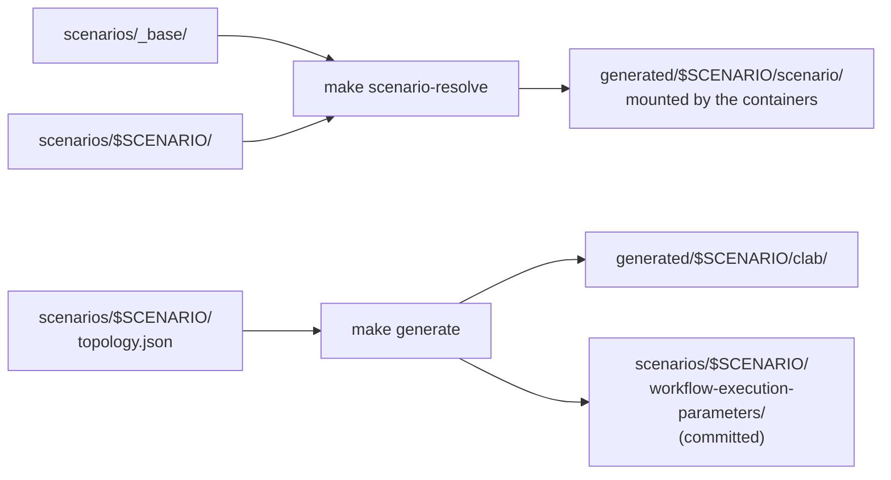

# neops-lab — Simple Lab

A turn-key local, multi-vendor lab with **real point-to-point wiring**,
provisioned by [containerlab](https://containerlab.dev). The control plane — CMS
+ workflow engine + a worker that runs the `global_discover_network` function
block + a one-shot bootstrap container — runs on docker-compose; the devices
attach to the same `lab-net` bridge (172.30.0.0/24) at fixed management IPs, so
the worker reaches them at those IPs.

Which network you get is a **scenario**. The default, `wan-and-fabric`, is 10
FRRouting routers + 5 Nokia SR Linux switches (15 devices); `frr-only` is the
same FRR half without the SR Linux fabric (10 devices). `make scenarios` lists
them — see [Scenarios](#scenarios).

The control plane runs from **published images** on `quay.io/zebbra`: the CMS,
the workflow engine, the web client and the worker. This repo owns the lab
itself: the scenarios,
the device configs, the workflow, the bootstrap sequencing and the two small
helper images.

End state: run a make target, click Run in the engine UI (or use the matching
make target), and one `Device` row per device in the scenario (FRR
`vendor=FRRouting`, Nokia `vendor=Nokia`) appears in the CMS — each with its
interfaces recorded. The discovery function block records each device **and its
interfaces** in one pass: it connects to every host via the matching connection
plugin, reads facts + interfaces, and writes both `Device` and `Interface` rows
to the CMS.

## Documentation

Full documentation lives in [`docs/`](./docs/) and is built with the shared
Zebbra MkDocs tooling:

```bash
make doc-serve   # live preview at http://localhost:8000
make doc-build   # build into site/
```

Start at [`docs/index.md`](./docs/index.md). This README stays the quick
operator reference; the site covers the topology model, the discovery
contract, the `/app/lab` mount rule, troubleshooting by symptom, and the
repo's invariants.

> ⚠️ Not to be confused with **`neops-remote-lab`** — a completely separate
> repo, a *remote* FastAPI service brokering queued access to real Netlab
> topologies for automated tests. It shares no code with this one. See
> [`docs/99-appendix/neops-ecosystem.md`](./docs/99-appendix/neops-ecosystem.md).

## Prerequisites

Supported hosts: **Linux and macOS** (Docker Desktop or OrbStack). Run the
preflight first — it checks everything below and prints the fix next to each
failure:

```bash
make doctor
```

- **Docker** + `docker compose` ≥ 2.20. No registry login needed: the CMS, the
  web client and the default **developer preview** engine all pull anonymously.
  `docker login quay.io` is only for swapping in the full licensed engine.
- **containerlab** needs no install: every make target and documented command
  uses `./containerlab`, which runs the official `ghcr.io/srl-labs/clab` image
  through the docker socket — the same command and the same pinned containerlab
  version on both hosts. `CLAB_IMAGE` overrides the version;
  `CLAB_NATIVE=/path/to/containerlab` selects a host binary instead. Verify
  with the 2-node probe:
  ```bash
  ./containerlab deploy  -t clab/probe.clab.yml
  ./containerlab destroy -t clab/probe.clab.yml --cleanup
  ```
  Prefer a native binary instead? Set
  `CLAB_NATIVE=$(command -v containerlab)`. On Linux that path needs the SUID
  setup — `make clab-suid` does it (idempotent; re-run after a containerlab
  upgrade, which replaces the binary and drops the SUID bit).
- **`openssl`** — `make lab-jwt` mints the dev RSA keypair under `cms/jwt/`
  that the CMS requires for RS256 JWT issuance (chained into
  `make local-env-init`, idempotent; OpenSSL 3 and the LibreSSL a stock macOS
  ships both work). The keypair is git-ignored: a throwaway lab credential.
- **`python3` ≥ 3.9** — the lab itself needs nothing else; all host scripts are
  stdlib-only and import under the `/usr/bin/python3` a stock macOS ships.
- **`uv`** — only for `make test` / `make lint` / `make check` and the docs.
- **`cms_api_key.env`** exists (produced by `make local-env-init` — needed once).
- **Nothing to build for the worker.** `quay.io/zebbra/neops-worker-sdk:develop`
  ships the base function blocks, `fb.base.neops.io/global_discover_network:0.1.0`
  among them, so the default path needs no local image. To try SDK changes before
  they are released, build the checkout and point the lab at it:

  ```bash
  make -C ../neops-worker-sdk-py build-docker      # -> neops-worker-sdk:latest
  echo 'NEOPS_WORKER_SDK_IMAGE=neops-worker-sdk:latest' >> .env
  ```

  Check what you got before bringing the lab up — the image must carry the
  block, not just build:

  ```bash
  docker run --rm --entrypoint sh neops-worker-sdk:latest -c 'ls neops/fb/base/global'
  ```

  Without this the worker container exits, `local-lab-up` burns its full
  `wait_ready` budget and gives up with `timeout: no online worker for
  fb.base.neops.io/global_discover_network:0.1.0`.
- **A workflow-engine image with the publish route and the large-payload +
  reference-resolution fixes.** Discovery emits a few hundred `Interface` rows in
  one job result, and `bootstrap/register.py` writes definitions through
  `POST /workflow-definition/publish`. The default is the **developer preview**,
  `quay.io/zebbra/neops-workflow-engine-preview:develop`, which has both
  and is public — nothing to log into. `NEOPS_WORKFLOW_ENGINE_IMAGE` replaces
  the whole reference, which is how you swap in the full licensed engine
  (`docker login quay.io` first, then
  `export NEOPS_WORKFLOW_ENGINE_IMAGE=quay.io/zebbra/neops-workflow-engine:develop`)
  or run a local build (`neops-workflow-engine:latest`); `NEOPS_ENGINE_TAG=<tag>`
  in `.env` pins just the tag on the preview.
  `NEOPS_WEB_CLIENT_IMAGE` and `NEOPS_WORKER_SDK_IMAGE` work the same way — see
  `.env.example`.
- **Host resources**: for `wan-and-fabric` the 5 SR Linux nodes want ≈1.5–2 GB
  each; with Elasticsearch and the control plane that scenario needs roughly
  **14–16 GB** for containers. `SCENARIO=frr-only` drops the SR Linux nodes and
  fits in far less. On macOS that is the Docker Desktop **VM** budget (Settings →
  Resources → Memory; the 8 GB default is too small). On Apple Silicon enable
  *Use Rosetta for x86_64/amd64 emulation* — the `quay.io/zebbra` images are
  amd64-only. The first `make local-lab-up` takes a couple of minutes; on a
  slow host raise the wait budgets
  (`make local-lab-up WAIT_READY_TIMEOUT=600 WAIT_DEVICES_TIMEOUT=600`).

## Scenarios

A **scenario** is a directory under [`scenarios/`](./scenarios/) holding
everything that makes one lab different from another: its topology, its
workflows, its CMS scope configuration, its device configs and its OIDC
configuration. Anything a scenario does not carry comes from
[`scenarios/_base/`](./scenarios/_base/), file by file.

```bash
make scenarios                        # what is available
make local-lab-up                     # the default scenario
make local-lab-up SCENARIO=frr-only   # a different one
```

| Scenario | Devices | Flavours | What it is |
|---|---|---|---|
| `wan-and-fabric` (default) | 15 | clab, kind | FRR WAN/core/edge/PE + a Nokia SR Linux leaf-spine fabric — see [`scenarios/wan-and-fabric/README.md`](./scenarios/wan-and-fabric/README.md) |
| `frr-only` | 10 | clab, kind | The FRR half alone; carries only a topology, everything else inherited — see [`scenarios/frr-only/README.md`](./scenarios/frr-only/README.md) |

`SCENARIO` selects it. The [`Makefile`](./Makefile) holds the **only** default
and exports it; every host script, both compose files and
[`apply_cms_config`](./apply_cms_config) fail when it is unset rather than guess,
because a scenario applied half from one lab and half from another stays
invisible until discovery produces a confusing result. Running `docker compose`
by hand therefore needs `SCENARIO=<name>` in front of it (or in `.env`).

**One scenario runs at a time**: they share `lab-net`, the `172.30.0.0/24`
subnet and the compose project. Switching means `make local-lab-down` first —
`make local-lab-up` refuses while a different scenario is deployed, because
`containerlab destroy` only removes the nodes the handed topology names.

`make scenario-resolve` materialises `scenarios/_base/` + `scenarios/$SCENARIO/`
into `generated/$SCENARIO/scenario/`, the one flat directory the containers mount
and the scripts read; it is a prerequisite of every target that consumes a
scenario. [`docs/30-scenarios/`](./docs/30-scenarios/) covers the mechanism, the
inheritance table and how to add one.

## Devices

The default `wan-and-fabric` scenario; `frr-only` is the FRR rows alone. Each
scenario's own device list is its
`scenarios/<name>/topology.json`.

| Hostname | Mgmt IP | Vendor | platform | login |
|---|---|---|---|---|
| core-rtr-01 … core-rtr-02 | 172.30.0.11–12 | FRRouting | `frr` | frr / frr |
| edge-rtr-01 … edge-rtr-02 | 172.30.0.13–14 | FRRouting | `frr` | frr / frr |
| pe-rtr-01 … pe-rtr-03 | 172.30.0.15–17 | FRRouting | `frr` | frr / frr |
| wan-rtr-01 … wan-rtr-02 | 172.30.0.18–19 | FRRouting | `frr` | frr / frr |
| border-rtr-01 | 172.30.0.20 | FRRouting | `frr` | frr / frr |
| spine-01 … spine-02 | 172.30.0.31–32 | Nokia SR Linux | `srl` | admin / NokiaSrl1! |
| leaf-01 … leaf-03 | 172.30.0.33–35 | Nokia SR Linux | `srl` | admin / NokiaSrl1! |

Each host's `platform` selects the SDK connection plugin used for discovery:
`frr` → `FRRNetmikoPlugin`, `srl` → `SRLinuxNetmikoPlugin` (both ship in
neops-worker-sdk-py under `neops_worker_sdk/connection/plugins/` and auto-register
at worker startup).

## Topology & interfaces

The devices are **really cabled** to each other with containerlab `veth` links —
a small DC fabric (SR Linux spine-leaf) plus an FRR WAN/core/edge — so the wiring
is live: interfaces on connected ports come up **UP**, and **LLDP neighbors are
real** (e.g. `spine-01` sees `leaf-01/02/03`). This is the foundation for
neighbor/topology-aware workflows later.

- **FRR routers** get `lo` + `swpN` ports (Cumulus-style `swp1`, `swp2`, …); `eth0`
  is the management interface. Data ports are real veths; their **descriptions**
  are stored as the Linux interface *alias* (which the FRR plugin reads).
- **SR Linux switches** get `mgmt0` + `ethernet-1/N` ports (containerlab's default
  `7220 IXR-D2L` variant, so many ports exist; the wired/configured ones carry
  descriptions, the rest show admin-disabled — realistic for a switch).
- **Host-facing / edge ports** (leaf→servers, pe→customer CE, border→ISP) have no
  peer device, so they are containerlab **`dummy` links** — a real stub interface
  with a description, no neighbor.

Interface descriptions encode the neighbor, e.g. `leaf-01:e1/1 -> spine-01:e1/1`.
Discovery records each interface into the CMS with its **up/down state and
description** for both vendors.

Mechanism — single source of truth → generated artifacts:



- `scenarios/<name>/topology.json` is the single source of truth for a scenario:
  per device its `mgmt_ip`, `vendor`, `loopback`, and `interfaces` (each with a
  `to` neighbor). It is the one file a scenario can never inherit from `_base`.
- [`gen_clab_topology`](./gen_clab_topology) (stdlib-only host script, run via
  `make generate`) renders from it:
  - `generated/<scenario>/clab/neops-lab.clab.json` — the containerlab topology
    (nodes, real `veth` links between devices, `dummy` links for stub ports),
  - `generated/<scenario>/clab/frr/<host>.iface` — FRR interface→description list,
  - `generated/<scenario>/clab/srl/<host>.cli` — SR Linux `set / interface …` config,
  - `scenarios/<scenario>/workflow-execution-parameters/discover-params.json` —
    one `/32` discovery target per device. Committed, and asserted byte-for-byte
    by `make test`.
- **FRR**: containerlab runs the custom image `neops-lab-frr:latest` (`kind:
  linux`, adds sshd + `frr/frr`), built by `make build-docker`. The image bakes
  **no** FRR configuration: `frr.conf`, `daemons` and `set-aliases.sh` are bound
  from the resolved scenario into `/lab/`, and
  [`devices/frr/entrypoint.sh`](./devices/frr/entrypoint.sh) installs the first
  two into `/etc/frr/` before FRR starts — refusing to boot if they are absent.
  One image therefore serves every scenario, and a scenario that wants `bgpd`
  ships a `daemons` delta. containerlab creates the `swpN` veths, then a
  containerlab `exec` runs `/lab/set-aliases.sh` **after wiring** to set each
  interface's alias (description); the Kubernetes flavour mounts the same three
  files at the same path from a ConfigMap.
- **SR Linux**: containerlab runs `ghcr.io/nokia/srlinux:26.3` (`kind:
  nokia_srlinux`) and applies the `.cli` as its `startup-config` at boot.

Everything generated lives under `generated/<scenario>/` (git-ignored, including
the containerlab runtime `generated/<scenario>/clab/clab-neops-lab` and the TLS
material containerlab mints there); only the scenario sources, the generators,
and the committed discovery parameter files are tracked.

## Layout

```
scenarios/_base/        # every asset a scenario may override
  workflows/            #   workflow YAMLs registered by the bootstrap container
  scope/Global/         #   table columns, drill-down and dashboard for apply_cms_config
  devices/frr/          #   frr.conf, daemons, set-aliases.sh — mounted at /lab, not baked
  function_blocks/      #   lab-local function blocks, auto-discovered by the worker
  cms/oidc-config.json  #   the web client's OIDC configuration
scenarios/<name>/       # one lab: topology.json + scenario.json + README.md (+ any override)
  workflow-execution-parameters/   # committed discovery inputs, generated from topology.json
resolve_scenario        # materialises _base + <name> -> generated/<name>/scenario
gen_clab_topology       # renders the scenario topology -> generated/<name>/clab/ + params
gen_device_configs      # per-device renderers + topology loading, reused by the others
gen_kind_manifests      # renders the FRR devices -> generated/<name>/kind/lab.yaml
gen_kind_discover_params # discovery targets for the pods: one /32 per Service ClusterIP
generated/<name>/       # git-ignored: scenario/ (resolved), clab/, kind/, clab runtime
clab/probe.clab.yml     # 2-node probe to re-check containerlab deploy works
devices/frr/            # Dockerfile (adds sshd to frrouting/frr) + entrypoint; no FRR config
cms/jwt/                # git-ignored dev RSA keypair (make lab-jwt)
bootstrap/              # one-shot container that POSTs every workflow YAML
containerlab            # containerlab launcher (runs ghcr.io/srl-labs/clab via the docker socket)
doctor                  # host preflight (docker, RAM, mount round-trip, subnets, images)
apply_cms_config        # seeds the neops role + Global scope in the CMS
run_workflow            # triggers a workflow execution and waits for a terminal state
wait_ready              # blocks until the worker's function block has an online worker
wait_devices            # blocks until every device in the scenario accepts SSH
docker-compose.yml               # base stack (CMS, engine, monitor app, web client, postgres, ES, redis)
docker-compose.worker.yml        # worker + lab_bootstrap + the lab-net network definition
tests/                  # unit tests for the generators and the scenario overlay
```

The base stack + worker compose files are combined via docker compose's
`COMPOSE_FILE` (target-scoped in the `Makefile`); containerlab provisions the
devices onto the `lab-net` that the worker compose defines.

The whole repo is bind-mounted **read-only into the worker at `/app/lab`**, which
is why in-container paths keep a `lab/` prefix (`DIR_FUNCTION_BLOCKS:
lab/generated/${SCENARIO}/scenario/function_blocks,neops/fb`, `docker compose
exec worker python3 lab/wait_devices`). Host-side paths never have one.

## Discovery inputs

`global_discover_network` accepts `subnets`; a single host is a `/32`. For
overlapping ranges the most specific prefix wins (longest prefix match).
Credentials are scoped from most to least specific: the owning subnet's
credentials, then the global list — where an entry may itself be scoped to a
platform, in which case it is tried first for hosts of that platform and
skipped for hosts declared as another one.

Each scenario carries its own set under
`scenarios/<name>/workflow-execution-parameters/`; the first three are generated
by `make generate` and must be committed.

- `discover-params.json`: one `/32` per device with known platforms and platform-scoped credentials.
- `discover-params-autodetect.json`: the same `/32`s without platforms.
- `discover-params-subnet.json`: the management `/24` with subnet-scoped credentials.
- `discover-params-mixed.json`: the `/24` plus `/32` overrides for the SR Linux
  nodes. Hand-written, so it exists only for `wan-and-fabric` — there is nothing
  to mix when every device runs the same NOS.

Override with `DISCOVER_PARAMS`, e.g.
`make local-lab-discover DISCOVER_PARAMS=scenarios/wan-and-fabric/workflow-execution-parameters/discover-params-autodetect.json`.

## Make targets

Every target below takes `SCENARIO=<name>` to run against a different scenario;
without it they use the `Makefile`'s default, `wan-and-fabric`.

| Target | What it does |
|---|---|
| `make scenarios` | Lists every scenario with its device count, flavours and summary, read from each `scenarios/<name>/scenario.json`. |
| `make scenario-resolve` | Materialises `scenarios/_base/` + `scenarios/$(SCENARIO)/` into `generated/$(SCENARIO)/scenario/` — the flat directory the containers mount and `apply_cms_config` reads. A prerequisite of every target that consumes a scenario, so it is rarely run by hand. |
| `make generate` | Resolves the scenario, then regenerates the containerlab topology, the per-device configs and the committed `scenarios/$(SCENARIO)/workflow-execution-parameters/*.json`. Commit those — `make test` asserts they reproduce byte-for-byte. |
| `make clab-suid` | Sets the SUID bit on the `containerlab` binary so the lab targets can deploy without sudo. Run once after installing containerlab and again after every upgrade (an upgrade drops the bit). Idempotent; needs sudo only when the bit is missing. Not chained into `local-lab-up`, which must never prompt for a password mid-run. |
| `make lab-jwt` | Mints the dev RSA keypair the CMS needs (`cms/jwt/`, created by the target). Idempotent; chained into `local-env-init`. |
| `make local-env-init` | Pull + start the base stack, mint the CMS API key, force-recreate the engine to load it, then chain `apply-cms-config`. One-time per env. |
| `make build-docker` | Builds the two local-only images: `neops-lab-frr:latest` (scenario-independent — it bakes no FRR config) and `neops-lab-bootstrap:latest`. A prerequisite of `local-lab-up`. `build-docker-frr` / `build-docker-bootstrap` build one each; `DOCKER_BUILD_FLAGS=--network=host` covers a host whose docker bridge has no DNS. |
| `make local-lab-up` | Resolves the scenario, generates the containerlab topology + configs from its `topology.json`, builds the lab images, brings up the base stack + worker + bootstrap (creating `lab-net`), then `containerlab deploy --reconfigure`s the scenario's devices with real links. Waits for workflow registration, the worker's function blocks, and every device's SSH. |
| `make apply-cms-config` | Grants the `neops` user a full-permission role (`lab-admin`, default_permission=7) + creates the `Global` scope so the web client can see all entities. Idempotent. Chained into `local-env-init`. |
| `make local-lab-discover` | POSTs an execution of the discovery workflow; every device in the scenario **and its interfaces** appears in the CMS. Override `DISCOVER_PARAMS` to exercise explicit hosts, autodetection, or subnet expansion. Devices are keyed by IP (re-running skips existing devices); interfaces are always recorded, so run discovery against a **fresh** CMS to avoid duplicate interface rows. |
| `make local-lab-logs` | Tails worker + bootstrap logs. |
| `make local-lab-down` | `containerlab destroy --cleanup` (removes the devices and `generated/$(SCENARIO)/clab/clab-neops-lab`) then `docker compose down` (preserves volumes). |
| `make local-env-prune` | `docker compose down -v` — the true reset, drops the ES + postgres volumes. |
| `make kind-lab-up` | The Kubernetes flavour: renders the scenario's **FRR** devices into `generated/$(SCENARIO)/kind/lab.yaml` and runs them as pods in a local KIND cluster, reachable over SSH at `<device>.neops-lab.svc.cluster.local`. Needs no containerlab, no compose stack and no control plane. `make kind-lab-status` / `make kind-lab-down` alongside it — the latter deletes the namespace, never the cluster. |
| `make kind-lab-cms-config` | Points the existing `apply_cms_config` at a Kubernetes-deployed CMS through `CMS_EXEC` (reused, not reimplemented): grants the `neops` user the `lab-admin` role and seeds the `Global` scope, without which the web client shows no scope. Idempotent. Getting devices into the CMS stays discovery's job. |
| `make kind-lab-discover` | Discovery against the pods, through the same scripts the containerlab flavour uses: publishes the workflow definition with `bootstrap/register.py`, generates one `/32` per device from the Service ClusterIPs with `./gen_kind_discover_params`, waits with `./wait_ready`, executes with `./run_workflow`. Needs a worker image that carries the base function blocks, and the engine reachable at `KIND_ENGINE_URL` — the offline ingress name `http://engine.neops.local` by default, so run `make -C neops-helm config-hosts` once. |
| `make lab-env` | Copies `.env.example` to `.env` if absent, so compose has one. A prerequisite of `local-lab-up`; never overwrites an existing `.env`. |
| `make local-env-up` / `make local-env-down` | The control plane alone — CMS, engine, monitor app, web client and their datastores — with no devices and no containerlab. |
| `make test` | `pytest tests` — unit tests for the generators and the scenario overlay, incl. that every scenario still reproduces its committed `workflow-execution-parameters/*.json` byte-for-byte. |
| `make lint` / `make format` / `make typeCheck` | ruff / pyrefly over the repo, including the extension-less host scripts. |
| `make py39-check` / `make shell-syntax` | The host scripts import under Python 3.9 (the stock macOS interpreter), and the bash entry points parse. |
| `make check` | All five gates together: lint, typeCheck, test, py39-check, shell-syntax. |

Full reset from scratch:
`make local-lab-down local-env-prune && make local-env-init && make local-lab-up && make local-lab-discover`.

## URLs

- Web client: <http://localhost:8080/>
- Engine UI: <http://localhost:3031>
- CMS admin: <http://localhost:8001/admin/> (login `neops` / `neops`)
- Engine REST: <http://localhost:3030>

## Adding a device

1. Add the device to `scenarios/<name>/topology.json`: a `mgmt_ip` (free IP in
   `172.30.0.0/24`), `vendor` (`frr` or `srl`), `loopback` (`lo` for FRR, `null`
   for SR Linux), and its `interfaces` (each `{ "name", "to" }`; `name` is `swpN`
   for FRR or `ethernet-1/N` for SR Linux; `to` is `"<peer-host>:<peer-iface>"`
   for a real link, or a plain label like `"server web-01"` for a host-facing
   stub port). Add the matching interface on the peer — `make test` asserts
   device-to-device links are symmetric.
2. `make generate SCENARIO=<name>` — rebuilds the containerlab topology (real
   link or `dummy` stub) and the discovery parameter files.
3. `make local-lab-up SCENARIO=<name> && make local-lab-discover SCENARIO=<name>`.
4. `make test` — the generator tests assert the regenerated parameter files match
   what is committed, so they fail until you commit the regenerated JSON.

## Adding a scenario

1. `mkdir scenarios/<name>`, then write `topology.json`, `scenario.json` (copy
   the shape from an existing one) and `README.md`.
2. Override anything from [`scenarios/_base/`](./scenarios/_base/) by placing a
   file at the same relative path; leave out what you want inherited.
3. `make generate SCENARIO=<name>`, then commit the generated
   `workflow-execution-parameters/*.json`.
4. `make test` — the generator and manifest guards run against every scenario, so
   a new one is covered without writing a new assertion.
