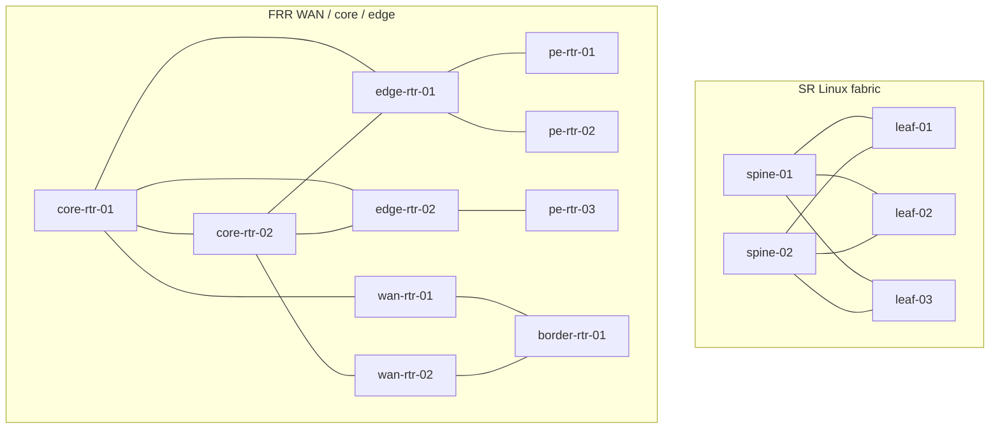

# Architecture

*Everything the lab runs, and how the control plane reaches the devices.*

## Two compose files, combined

The lab is declared in two files:

| File | Declares |
|---|---|
| `docker-compose.yml` | The **base stack**: CMS, workflow engine, monitor app, web client, Postgres, Elasticsearch, Redis, plus a `wait_health` helper |
| `docker-compose.worker.yml` | The **worker overlay**: the `worker`, the one-shot `lab_bootstrap`, and the (external) `lab-net` network they attach to |

They are combined through docker compose's `COMPOSE_FILE` environment variable, exported only for the lab targets in the `Makefile`:

```make
LAB_COMPOSE_FILES := docker-compose.yml:docker-compose.worker.yml
local-lab-up local-lab-down local-lab-discover local-lab-logs: export COMPOSE_FILE := $(LAB_COMPOSE_FILES)
```

The scoping is deliberate: `local-env-*` targets keep using the base `docker-compose.yml` only, so you can run the control plane without the worker or the devices.

!!! warning "`docker compose` by hand needs the same environment"
    Running `docker compose logs worker` in a plain shell will not find the
    service — the base file does not declare it. Either use the make targets,
    or export the variable yourself:

    ```bash
    export COMPOSE_FILE=docker-compose.yml:docker-compose.worker.yml
    ```

## Services

| Service | Image | Published port | Notes |
|---|---|---|---|
| `cms` | `quay.io/zebbra/neops-cms-free:develop` | `8001` → 8000 | Django CMS + GraphQL. Runs `migrate`, creates the `neops` superuser, builds the ES index, then `runserver`. `REDIS_URL` points it at `redis` |
| `workflow_engine` | `quay.io/zebbra/neops-workflow-engine:0.42.2-beta.3` (pinned) | `3030` | Reads the CMS token from `cms_api_key.env` |
| `workflow-engine-client` | same image as the engine | `3031` → 5173 | The **monitor app**, run in dev mode (`npm install && npm run dev`) out of `/app/rest/monitor-app` |
| `web_client` | `quay.io/zebbra/neops-web-client:develop` | `8080` | `FRONTEND_*` env vars are browser-relative, so they point at host ports |
| `worker` | `quay.io/zebbra/neops-worker-sdk:develop` | — | On **both** networks; polls the engine's blackboard and drives the devices |
| `lab_bootstrap` | `neops-lab-bootstrap:latest` (local) | — | One-shot: publishes every `workflows/*.yaml` to the engine (`POST /workflow-definition/publish`), then exits |
| `postgres` | `postgres:15-alpine` | — | Volume `postgres_data` |
| `elasticsearch` | `docker.elastic.co/elasticsearch/elasticsearch:8.9.2` | — | Volume `elasticsearch`; 2 CPU / 4 GB limits (2 GB heap) |
| `redis` | `redis:7-alpine` | — | The CMS's channel layer (GraphQL subscriptions), Django cache and Celery broker — as in production |
| `wait_health` | `busybox` | — | Depends on CMS + engine + web client being *healthy*, so `up -d` blocks until they are |

Every published image (`cms`, `workflow_engine`/`workflow-engine-client`, `web_client`, `worker`) reads a `NEOPS_*_IMAGE` variable and sets `pull_policy: missing` — see [Images](../20-operations/20-images.md), including why the engine is pinned and why the worker currently needs a local build.

## Networks

```mermaid
graph LR
  subgraph default["compose default network"]
    cms[cms :8000]
    engine[workflow_engine :3030]
    monitor[workflow-engine-client :5173]
    wc[web_client :8080]
    boot[lab_bootstrap]
    pg[(postgres)]
    es[(elasticsearch)]
  end
  subgraph labnet["lab-net — 172.30.0.0/24"]
    dev1["core-rtr-01 … border-rtr-01<br/>172.30.0.11–20"]
    dev2["spine-01 … leaf-03<br/>172.30.0.31–35"]
  end
  worker[worker]
  default --- worker
  worker --- labnet
  worker -- "URL_BLACKBOARD<br/>http://workflow_engine:3030" --> engine
  worker -- "SSH 22" --> dev1
  worker -- "SSH 22" --> dev2
  boot -- "POST /workflow-definition/publish" --> engine
```

`lab-net` is created by the **Makefile** — `make lab-net`, a prerequisite of every `*-up` target — with the fixed subnet `172.30.0.0/24` (`LAB_SUBNET`, single-sourced with `gen_clab_topology` and cross-checked by a test), and `docker-compose.worker.yml` declares it `external: true`. containerlab's topology sets `mgmt.network: lab-net` with the same subnet. That is the join: the Makefile creates the bridge, compose attaches the worker and the bootstrap container, containerlab attaches the devices at their fixed `mgmt-ipv4`, and the worker — a member of both networks — reaches the engine by service name *and* the devices by IP.

!!! note "Why the Makefile creates it, and why before compose"
    Compose creates its auto-subnetted networks (`default`) concurrently. On a
    host with many docker networks the next free `/16` in docker's pool can be
    `172.30.0.0/16` — which then blocks the lab's `/24` with "Pool overlaps
    with other one on this address space". Creating the fixed network *first*
    makes docker's allocator skip it. `local-lab-down` and `local-env-prune`
    remove it again, and `make lab-net` refuses a stale `lab-net` with a
    different subnet.

!!! note "Ordering matters"
    `make local-lab-up` runs `docker compose up -d` **before**
    `./containerlab deploy` so that workflow registration and the worker's
    start overlap the slow SR Linux boot; `lab-net` itself already exists by
    then.

## The devices

| Hostname | Mgmt IP | Vendor | `vendor` in `topology.json` | Login |
|---|---|---|---|---|
| `core-rtr-01` … `core-rtr-02` | 172.30.0.11–12 | FRRouting | `frr` | `frr` / `frr` |
| `edge-rtr-01` … `edge-rtr-02` | 172.30.0.13–14 | FRRouting | `frr` | `frr` / `frr` |
| `pe-rtr-01` … `pe-rtr-03` | 172.30.0.15–17 | FRRouting | `frr` | `frr` / `frr` |
| `wan-rtr-01` … `wan-rtr-02` | 172.30.0.18–19 | FRRouting | `frr` | `frr` / `frr` |
| `border-rtr-01` | 172.30.0.20 | FRRouting | `frr` | `frr` / `frr` |
| `spine-01` … `spine-02` | 172.30.0.31–32 | Nokia SR Linux | `srl` | `admin` / `NokiaSrl1!` |
| `leaf-01` … `leaf-03` | 172.30.0.33–35 | Nokia SR Linux | `srl` | `admin` / `NokiaSrl1!` |

Those credentials are lab-only: they reach throwaway containers on a local bridge and are published in this documentation on purpose.

The `vendor` value doubles as the discovery **platform** short name, which is what selects the SDK connection plugin: `frr` → `FRRNetmikoPlugin`, `srl` → `SRLinuxNetmikoPlugin`. Both ship in `neops-worker-sdk-py` under `neops_worker_sdk/connection/plugins/` and auto-register at worker startup.

## The wiring

The devices are cabled to each other with containerlab `veth` links — a Nokia SR Linux spine-leaf fabric plus an FRR WAN/core/edge domain:



Ports that face something outside the lab — leaf→server, pe→customer CE, border→ISP — have no peer device, so they become containerlab **`dummy` links**: a real stub interface with a description and no neighbour.

Because the links are real, interface state is real: connected ports come up **UP** and LLDP neighbours resolve (`spine-01` sees `leaf-01/02/03`). That is what makes the lab a usable substrate for neighbour- and topology-aware work.

!!! note "The two fabrics are not interconnected"
    The FRR domain and the SR Linux fabric are separate islands in the data
    plane; they meet only on the shared `lab-net` management network. Nothing
    in the lab routes between them today.

## What is authored vs generated

| Tracked in git | Generated (git-ignored) |
|---|---|
| `topology.json`, `gen_clab_topology`, `gen_device_configs` | `generated/neops-lab.clab.json` |
| `devices/frr/` (Dockerfile, `frr.conf`, `daemons`, `entrypoint.sh`, `set-aliases.sh`) | `generated/frr/<host>.iface` |
| `workflows/`, `function_blocks/`, `bootstrap/`, `scope/Global/`, `cms/oidc-config.json` | `generated/srl/<host>.cli` |
| `workflow-execution-parameters/*.json` | `generated/clab-neops-lab/` (containerlab runtime, incl. minted TLS keys) |
| the compose files, the `Makefile`, the host scripts | `cms/jwt/`, `cms_api_key.env` |

Everything under `generated/` is rebuilt from `topology.json` on every `make local-lab-up`. Never commit it — containerlab mints TLS private keys in there.
