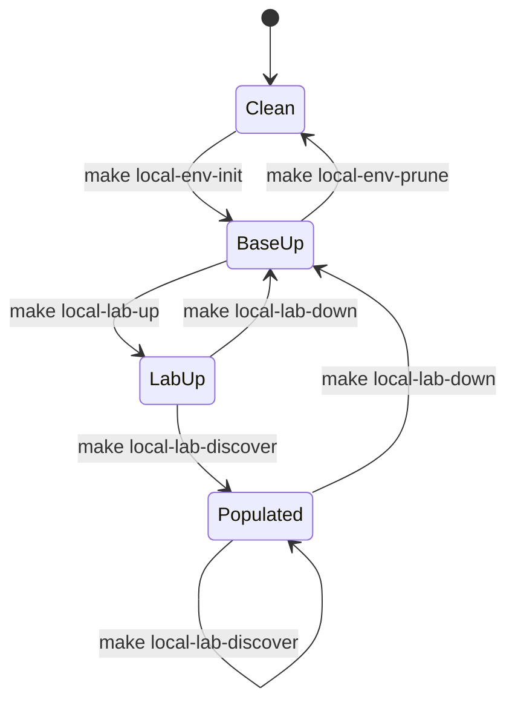

# Operating the lab

*Everything you need after the first successful run.*

## In this section

-   :material-console-line:{ .lg .middle } &nbsp; **[Make targets](10-make-targets.md)**

    ---

    The complete list — lab lifecycle, environment lifecycle, quality gates, and the targets the two vendored tooling repos contribute. What each one does and when to reach for it.

-   :material-docker:{ .lg .middle } &nbsp; **[Images](20-images.md)**

    ---

    The two local-only images this repo builds (`neops-lab-frr`, `neops-lab-bootstrap`), the four published images it consumes, and how to swap any of them for a local build.

-   :material-plus-network:{ .lg .middle } &nbsp; **[Adding a device](30-adding-a-device.md)**

    ---

    The four-step loop: edit `topology.json`, regenerate, redeploy, commit the regenerated parameter files — because the generator tests will fail until you do.

-   :material-lifebuoy:{ .lg .middle } &nbsp; **[Troubleshooting](40-troubleshooting.md)**

    ---

    Indexed by symptom. Most failures here are one of three boot-order races, each with a distinctive error string and a wait that already exists to prevent it.

## The lifecycle at a glance

`local-lab-down` destroys the devices and stops the containers but **keeps** the Elasticsearch and Postgres volumes, so the CMS data survives. `local-env-prune` is the real reset.
