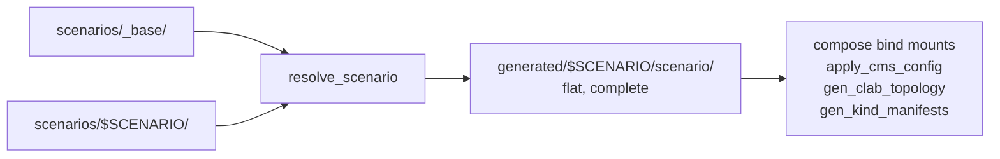

# Scenarios

The lab can hold more than one network. A **scenario** is a directory under
`scenarios/` carrying everything that makes one lab different from another: its
topology, its workflows, its CMS scope configuration, its device configs and its
OIDC configuration.

```bash
make scenarios                          # what is available
make local-lab-up                       # the default scenario
make local-lab-up SCENARIO=frr-only     # a different one
```

One scenario runs at a time. They share `lab-net`, the `172.30.0.0/24` subnet
and the compose project, so switching means tearing the running one down first:
both `make local-lab-up` and `make kind-lab-up` refuse while a different
scenario is deployed, and each records which one in `generated/.deployed-scenario-*`.

## What a scenario owns

Anything a scenario does not carry comes from `scenarios/_base/`, file by file.
A scenario that overrides one file in `scope/Global/` keeps the base's other
five; a scenario that adds a workflow keeps the base's discovery workflow too.

| Path | Inherited from `_base`? |
| --- | --- |
| `topology.json` | No — required in every scenario |
| `scenario.json`, `README.md` | No — required in every scenario |
| `workflow-execution-parameters/*.json` | No — generated from the topology |
| `workflows/*.yaml` | Yes |
| `scope/<name>/*.json` | Yes |
| `devices/frr/frr.conf`, `daemons`, `set-aliases.sh` | Yes |
| `function_blocks/` | Yes |
| `cms/oidc-config.json` | Yes |

`resolve_scenario` and all four generators take `--scenario NAME` as an
alternative to `$SCENARIO`; `./resolve_scenario --list` prints the table
`make scenarios` shows, and `--quiet` drops the per-file listing. Run by hand
with neither the flag nor the variable they refuse rather than guess, because
the Makefile holds the only default.

`topology.json` is the one thing never inherited: a scenario *is* its topology,
so there is no meaningful base to fall back to.

## How it is resolved



The resolved tree is the plain union of both directories, with no carve-outs:
`scenario.json`, `README.md`, `topology.json` and
`workflow-execution-parameters/` land there too, not only the assets something
mounts. Note that the generators still read `scenarios/<name>/topology.json`
rather than the resolved copy, so do not "fix" one to read the other.

`docker compose` cannot express a fallback in a bind mount, so the overlay is
materialised once — by `make scenario-resolve`, a prerequisite of every target
that consumes a scenario — into one flat directory. Nothing downstream knows
overlays exist, and the rule lives in exactly one place instead of being
reimplemented in Python, in bash and in YAML.

`resolve_scenario` prunes whatever a previous resolve left behind, so removing
an override takes effect on the next run rather than lingering.

## One selector, one default

`SCENARIO` is the only selector. The Makefile exports it and holds the **only**
default; every script, compose file and bash entry point fails when it is unset
rather than guessing. A scenario applied half from one lab and half from another
is invisible until discovery produces a confusing result, which is a far more
expensive failure than a target that refuses to run.

The compose files use `${SCENARIO:?…}` rather than a bare reference for the same
reason: left to warn, compose interpolates a blank path and docker creates the
missing bind source as an empty directory — the lab would come up having
registered no workflows at all.

## Adding a scenario

1. `mkdir scenarios/<name>`, then write `topology.json`, `scenario.json` and
   `README.md`. The manifest is a contract, enforced by
   `tests/test_scenario_manifests.py`:

    | Key | Rule |
    |---|---|
    | `name` | Must equal the directory name |
    | `title` | Short label, shown by `make scenarios` |
    | `summary` | One sentence, non-empty |
    | `flavours` | Non-empty subset of `clab`, `kind`. Listing `kind` requires at least one FRR device, since the Kubernetes flavour renders those only |
    | `demonstrates` | Non-empty list of what the scenario is for |

    A `README.md` is required beside it, and every device's `mgmt_ip` must be
    unique within the scenario.
2. `make generate SCENARIO=<name>` — writes the containerlab topology under
   `generated/<name>/clab/` and the committed
   `scenarios/<name>/workflow-execution-parameters/*.json`.
3. `make test` — the generator and manifest guards run against every scenario,
   so this is where a topology that does not round-trip, or a link left pointing
   at a device you removed, is caught.
4. Commit the regenerated parameter files. `make test` fails if they drift.

Add only what differs from `scenarios/_base/`. A scenario needing a different
FRR baseline ships a `devices/frr/daemons` or `devices/frr/frr.conf` delta —
there is no second image to build, because the FRR image no longer bakes either
file.

## The scenarios that ship

--8<-- "../scenarios/wan-and-fabric/README.md"

--8<-- "../scenarios/frr-only/README.md"
