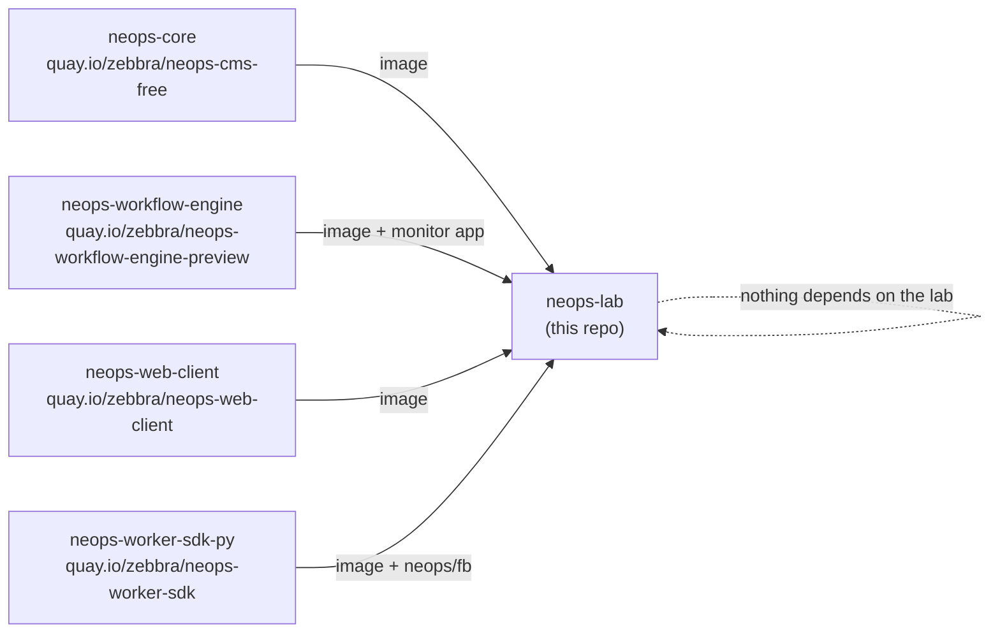

# NeOps ecosystem

*The lab is a **consumer**, not a producer. It wires published artifacts together; it defines no API and nothing imports it.*

## Not to be confused with `neops-remote-lab`

Two repos in the NeOps workspace have "lab" in the name. They share **no code, no API and no dependency** — the only thing they have in common is that both eventually talk to network devices.

| | `neops-lab` (this repo) | `neops-remote-lab` |
|---|---|---|
| **What it is** | A local containerlab dev/demo environment | A FastAPI *service* brokering access to a shared lab host |
| **Where it runs** | Your machine | A shared remote Netlab host |
| **Device platform** | containerlab, from `topology.json` | [Netlab](https://netlab.tools/), from Netlab topology YAML |
| **Who uses it** | Humans — demoing and developing against a populated NeOps | Automated tests — `pytest` via `remote_lab_fixture` |
| **Access model** | You own the whole thing | Exclusive, FIFO-queued sessions with heartbeats |
| **Published?** | Nothing. No wheel, no npm package, no image | PyPI package `neops-remote-lab` |
| **Who depends on it** | Nobody | `neops-worker-sdk-py` (`neops-remote-lab>=1.3.0`) |
| **Ships a control plane?** | Yes — CMS, engine, monitor app, web client, worker | No — devices only |

**Rule of thumb:** if you need a real device inside a `pytest` run, you want Remote Lab. If you want to click around a populated NeOps on your laptop, you want this repo.

There is a third thing occasionally confused with both: `neops-worker-sdk-py/lab/`, the directory this repo was extracted *from*. It no longer exists there.

## What the lab consumes



Four published images, plus `ghcr.io/nokia/srlinux`, Postgres, Elasticsearch and Redis. Everything this repo owns is the *glue*: the topology, the device configs, the workflow, the bootstrap sequencing, the CMS seeding, and two small helper images.

## The contracts it depends on

None of these are verified at build time. All three fail at runtime, in the lab, with a message that does not obviously point at the cause.

### The function-block identifier

```text
fb.base.neops.io/global_discover_network:0.1.0
```

Named in `workflows/simple-lab-discovery.workflow.yaml` and in the `Makefile`'s `DISCOVER_FB`. Renaming it in `neops-worker-sdk-py` breaks both, **with no compile-time check**. Symptom: `Function block … not found`.

### The workflow-engine REST API

Used by three things in this repo:

| Caller | Endpoints |
|---|---|
| `bootstrap/register.py` | `GET /health`, `POST /workflow-definition/publish` (legacy `POST /workflow-definition` fallback on 404) |
| `wait_ready` | `GET /function-blocks/{pkg}/{name}/{version}/workers` |
| `run_workflow` | `POST /workflow-execution`, `GET /workflow-execution/id/{uuid}` |

`run_workflow` also encodes the engine's terminal-state vocabulary: `completed_ack`, `failed_safe_ack`, `failed_unsafe_ack`. A change to any of these in `neops-workflow-engine` breaks the lab's automation, not just its output.

### The CMS

`apply_cms_config` depends on the GraphQL mutation `scopesUpsert` **and** on the `neops.core.models` ORM shape it manipulates through `manage.py shell`. It also depends on the image seeding a scope named `Global` and on `init_scopes` re-running on every `manage.py` invocation — which is why its step ordering is load-bearing.

## Where the lab fits in a change

Because nothing imports it, the lab is never the *source* of a cross-repo change. It is frequently the *victim* of one:

- a function-block rename in `neops-worker-sdk-py` → update the workflow YAML and `DISCOVER_FB` here;
- an engine REST/DTO change in `neops-workflow-engine` → check `register.py`, `wait_ready`, `run_workflow`;
- a CMS model or permission change in `neops-core` → check `apply_cms_config` and the `scope/Global/*.json` files.

Conversely, the lab is a good place to *notice* such a change early, because it exercises the whole stack end to end against real devices with one command.

## External references

- [containerlab](https://containerlab.dev/) — device runtime and link wiring.
- [FRRouting](https://frrouting.org/) — the FRR nodes.
- [Nokia SR Linux](https://learn.srlinux.dev/) — the SR Linux nodes.
- [Netlab](https://netlab.tools/) — used by `neops-remote-lab`, **not** by this repo.
- [NeOps platform docs](https://docs.neops.io/) — the umbrella site.
