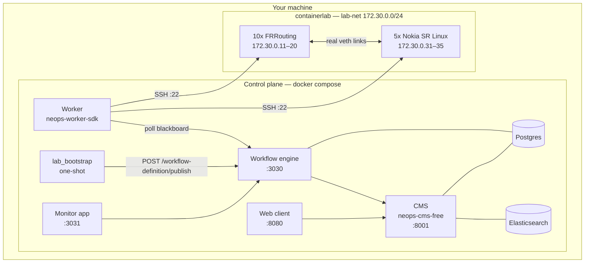

# NeOps Lab

*A turn-key **local** multi-vendor lab: 10 FRRouting routers + 5 Nokia SR Linux switches (15 devices) with real point-to-point wiring, provisioned by [containerlab](https://containerlab.dev), plus the full NeOps control plane on docker compose.*

`neops-lab` gives you the whole platform on one machine. The control plane — CMS, workflow engine, monitor app, web client, worker — runs as containers; the devices attach to the same `lab-net` bridge (`172.30.0.0/24`) at fixed management IPs, so the worker can SSH to them exactly the way it would reach real hardware. Four make targets later, **15 `Device` rows — each with its interfaces — appear in the web client.**

This repo owns *the lab*: the topology, the device configs, the workflow, the bootstrap sequencing and two small helper images. Everything else comes from published `quay.io/zebbra` images.

!!! danger "This is not `neops-remote-lab`"
    Two repos in the NeOps workspace have "lab" in the name and they share
    **nothing** — no code, no API, no dependency.

    - **`neops-lab`** (this repo) — a *local* containerlab dev/demo
      environment you run on your own machine. Docker compose + containerlab,
      15 containerised devices, the full control plane. Nobody imports it; it
      defines no API.
    - **`neops-remote-lab`** — a *shared, remote* FastAPI service that gives
      automated tests exclusive, FIFO-queued access to real
      [Netlab](https://netlab.tools/) topologies. It is a published PyPI
      package that `neops-worker-sdk-py` imports as `remote_lab_fixture`.

    If you are trying to get a real device under a **pytest** run, you want
    Remote Lab. If you want to *click around a populated NeOps* on your laptop,
    you are in the right place. See
    [NeOps ecosystem](99-appendix/neops-ecosystem.md).

## Pick your path

-   :material-rocket-launch:{ .lg .middle } &nbsp; **First time here**

    ---

    *From a clean checkout to 15 discovered devices.*

    - What your host needs (containerlab, Docker, Quay pull access)
    - Four commands, in order, and what each one waits for
    - The URLs the lab publishes and what to click first

    [Get started :material-arrow-right:](getting-started/index.md)

-   :material-book-open-page-variant:{ .lg .middle } &nbsp; **Understand the moving parts**

    ---

    *The mental model before you change anything.*

    - Which containers exist, on which networks, on which ports
    - `topology.json` as the single source of truth, and what is generated from it
    - How discovery turns a CIDR list into `Device` + `Interface` rows

    [Concepts :material-arrow-right:](10-concepts/index.md)

-   :material-console:{ .lg .middle } &nbsp; **Run and fix it**

    ---

    *Day-to-day operation.*

    - Every make target, what it does, and when to reach for it
    - The two local-only images and the three overridable published ones
    - Race conditions, boot-order symptoms, and the full-reset recipe

    [Operate the lab :material-arrow-right:](20-operations/index.md)

-   :material-source-branch:{ .lg .middle } &nbsp; **Change the repo**

    ---

    *Contributing safely.*

    - `make check` — ruff, pyrefly, pytest
    - The extension-less-script rule that silently skips linting if you forget it
    - The invariants that are load-bearing and not visible from the code

    [Develop :material-arrow-right:](60-development/index.md)

## What the lab looks like

The devices are **really cabled** to each other — a small SR Linux spine-leaf fabric plus an FRR WAN/core/edge domain. Interfaces on connected ports come up **UP** and LLDP neighbours are real, which is what makes the lab useful for neighbour- and topology-aware work rather than just row-counting.

## End state

Run [the quickstart](getting-started/20-quickstart.md) and you get:

| URL | What it is |
|---|---|
| <http://localhost:8080/> | Web client — the entity browser where the 15 devices show up |
| <http://localhost:3031> | Monitor app — workflow authoring and execution monitoring |
| <http://localhost:3030> | Workflow engine REST API |
| <http://localhost:8001/admin/> | CMS Django admin (`neops` / `neops`) |
| <http://localhost:8001/graphql> | CMS GraphQL API |

## Reading paths

!!! tip "You just want it running"
    [Prerequisites](getting-started/10-prerequisites.md) → [Quickstart](getting-started/20-quickstart.md) → [Your first discovery](getting-started/30-first-discovery.md).

!!! info "It came up wrong"
    [Troubleshooting](20-operations/40-troubleshooting.md) → [Make targets](20-operations/10-make-targets.md) → [Architecture](10-concepts/10-architecture.md). Most failures are a boot-order race with a very specific error string; the troubleshooting page indexes them by symptom.

!!! info "You want to change the network"
    [Topology as source of truth](10-concepts/20-topology.md) → [Adding a device](20-operations/30-adding-a-device.md) → [Dev setup](60-development/10-dev-setup.md). Everything flows from `topology.json`; the generator tests fail until you commit the regenerated JSON.

!!! info "Discovery found nothing / found the wrong thing"
    [Discovery](10-concepts/30-discovery.md) → [The `/app/lab` mount](10-concepts/40-container-paths.md) → [Troubleshooting](20-operations/40-troubleshooting.md). The function block lives in the *worker image*, not in this repo.

## External references

- [containerlab](https://containerlab.dev/) — the tool that wires the veths and runs the device containers.
- [FRRouting](https://frrouting.org/) — the routing stack behind the 10 `frr` nodes.
- [Nokia SR Linux](https://learn.srlinux.dev/) — the NOS behind the 5 `srl` nodes.
- [NeOps platform docs](https://docs.neops.io/) — the umbrella site for the wider platform.
- Repository [`README.md`](https://github.com/zebbra/neops-lab/blob/develop/README.md) and [`AGENTS.md`](https://github.com/zebbra/neops-lab/blob/develop/AGENTS.md) — operator contract and agent context.
