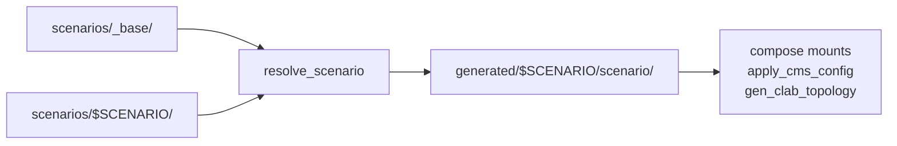

# Lab Scenarios Implementation Plan

> **For agentic workers:** REQUIRED SUB-SKILL: Use superpowers:subagent-driven-development (recommended) or superpowers:executing-plans to implement this plan task-by-task. Steps use checkbox (`- [ ]`) syntax for tracking.

**Goal:** Let one `neops-lab` checkout hold many labs — different topologies, workflows, scope configs and device configs — grouped one directory per scenario and selected with a single `SCENARIO` variable.

**Architecture:** `scenarios/<name>/` is overlaid file-by-file on `scenarios/_base/` and materialised by a new `resolve_scenario` host script into `generated/<name>/scenario/`. Every downstream consumer — the four generators, `apply_cms_config`, both compose files — reads that one flat directory, so nothing but the resolver knows overlays exist. `SCENARIO` is exported by the Makefile and required by everything else.

**Tech Stack:** Python 3.9-safe stdlib-only host scripts (no `.py` extension), bash 3.2, GNU make, docker compose interpolation, pytest.

**Spec:** `docs/superpowers/specs/2026-09-08-lab-scenarios-design.md`

---

## File Structure

**Created:**

| Path | Responsibility |
| --- | --- |
| `resolve_scenario` | Owns where scenarios live, the overlay rule, and the resolved-tree layout. The only module that knows `scenarios/` and `generated/<name>/` exist. |
| `scenarios/_base/**` | Every asset a scenario may override. |
| `scenarios/wan-and-fabric/**` | Today's lab: topology, committed discovery params, manifest, README. |
| `scenarios/frr-only/**` | Second scenario proving the overlay: the 10 FRR devices, everything else inherited. |
| `tests/test_resolve_scenario.py` | The overlay rule: precedence, per-file granularity, pruning, error paths. |
| `tests/test_scenario_manifests.py` | Every `scenario.json` parses and is well-formed. |
| `docs/30-scenarios/index.md` | Operator-facing explanation of the mechanism. |

**Modified:** `gen_device_configs`, `gen_clab_topology`, `gen_kind_manifests`, `gen_kind_discover_params`, `apply_cms_config`, `devices/frr/Dockerfile`, `devices/frr/entrypoint.sh`, `docker-compose.yml`, `docker-compose.worker.yml`, `Makefile`, `pyproject.toml`, `.env.example`, `README.md`, `AGENTS.md`, `mkdocs_custom.yml`, and the four generator test modules plus `tests/test_host_invariants.py`.

**Task order matters.** Task 1 is standalone. Task 2 moves files and *breaks the repo*; Tasks 3–6 restore it. Do not stop between 2 and 6.

---

### Task 1: `resolve_scenario` — the overlay resolver

**Files:**
- Create: `resolve_scenario`
- Create: `tests/test_resolve_scenario.py`
- Modify: `pyproject.toml:45-53` (ruff `extend-include`), `pyproject.toml:132-144` (pyrefly `project-includes`)

- [ ] **Step 1: Write the failing tests**

Create `tests/test_resolve_scenario.py`:

```python
"""Unit tests for the scenario overlay resolver.

`resolve_scenario` is an executable script (no `.py` extension) living at the
repo root, so we load it by path via `importlib.util` (same pattern as
`test_gen_device_configs.py`).

Every test redirects the script's module-level directories at a tmp_path, so
nothing here reads or writes the real `scenarios/` or `generated/` trees.
"""

import importlib.machinery
import importlib.util
import json
import pathlib

import pytest

LAB_DIR = pathlib.Path(__file__).resolve().parents[1]
SCRIPT_PATH = LAB_DIR / "resolve_scenario"

_loader = importlib.machinery.SourceFileLoader("resolve_scenario", str(SCRIPT_PATH))
_spec = importlib.util.spec_from_loader(_loader.name, _loader)
assert _spec is not None
gen = importlib.util.module_from_spec(_spec)
_loader.exec_module(gen)


def _write(path, content):
    path.parent.mkdir(parents=True, exist_ok=True)
    path.write_text(content)


@pytest.fixture
def lab(tmp_path, monkeypatch):
    """A miniature repo: `_base` plus a `demo` scenario, both redirected."""
    scenarios = tmp_path / "scenarios"
    base = scenarios / "_base"
    demo = scenarios / "demo"

    _write(base / "workflows" / "discovery.yaml", "base discovery\n")
    _write(base / "scope" / "Global" / "devicecolumns.json", '{"from": "base"}\n')
    _write(base / "devices" / "frr" / "frr.conf", "base frr.conf\n")

    _write(demo / "scenario.json", json.dumps({"name": "demo", "title": "Demo", "summary": "s", "flavours": ["clab"]}))
    _write(demo / "topology.json", '{"devices": {}}\n')

    monkeypatch.setattr(gen, "SCENARIOS_DIR", scenarios)
    monkeypatch.setattr(gen, "BASE_DIR", base)
    monkeypatch.setattr(gen, "GENERATED_DIR", tmp_path / "generated")
    monkeypatch.delenv("SCENARIO", raising=False)
    return tmp_path


def test_base_only_file_comes_from_base(lab):
    gen.resolve("demo")
    resolved = lab / "generated" / "demo" / "scenario"
    assert (resolved / "workflows" / "discovery.yaml").read_text() == "base discovery\n"


def test_scenario_file_wins_over_base(lab):
    _write(lab / "scenarios" / "demo" / "devices" / "frr" / "frr.conf", "demo frr.conf\n")
    gen.resolve("demo")
    resolved = lab / "generated" / "demo" / "scenario"
    assert (resolved / "devices" / "frr" / "frr.conf").read_text() == "demo frr.conf\n"


def test_override_is_per_file_not_per_directory(lab):
    """Overriding one file in a directory keeps the base's siblings."""
    _write(lab / "scenarios" / "demo" / "scope" / "Global" / "devicecolumns.json", '{"from": "demo"}\n')
    _write(lab / "scenarios" / "_base" / "scope" / "Global" / "groupcolumns.json", '{"from": "base"}\n')
    gen.resolve("demo")
    scope = lab / "generated" / "demo" / "scenario" / "scope" / "Global"
    assert scope.joinpath("devicecolumns.json").read_text() == '{"from": "demo"}\n'
    assert scope.joinpath("groupcolumns.json").read_text() == '{"from": "base"}\n'


def test_scenario_only_file_is_added_alongside_base(lab):
    _write(lab / "scenarios" / "demo" / "workflows" / "extra.yaml", "demo extra\n")
    gen.resolve("demo")
    workflows = lab / "generated" / "demo" / "scenario" / "workflows"
    assert {p.name for p in workflows.iterdir()} == {"discovery.yaml", "extra.yaml"}


def test_removed_override_is_pruned_on_the_next_resolve(lab):
    extra = lab / "scenarios" / "demo" / "workflows" / "extra.yaml"
    _write(extra, "demo extra\n")
    gen.resolve("demo")
    extra.unlink()
    gen.resolve("demo")
    workflows = lab / "generated" / "demo" / "scenario" / "workflows"
    assert {p.name for p in workflows.iterdir()} == {"discovery.yaml"}


def test_executable_bit_survives_the_copy(lab):
    script = lab / "scenarios" / "_base" / "devices" / "frr" / "set-aliases.sh"
    _write(script, "#!/bin/sh\n")
    script.chmod(0o755)
    gen.resolve("demo")
    copied = lab / "generated" / "demo" / "scenario" / "devices" / "frr" / "set-aliases.sh"
    assert copied.stat().st_mode & 0o111


def test_plan_reports_where_each_file_came_from(lab):
    _write(lab / "scenarios" / "demo" / "devices" / "frr" / "frr.conf", "demo frr.conf\n")
    resolved = gen.plan("demo")
    base = lab / "scenarios" / "_base"
    assert resolved[pathlib.Path("workflows/discovery.yaml")].is_relative_to(base)
    assert not resolved[pathlib.Path("devices/frr/frr.conf")].is_relative_to(base)


def test_unknown_scenario_lists_the_available_ones(lab):
    with pytest.raises(SystemExit, match="unknown scenario 'nope'.*demo"):
        gen.source_dir("nope")


def test_missing_topology_is_an_error(lab):
    (lab / "scenarios" / "demo" / "topology.json").unlink()
    with pytest.raises(SystemExit, match="missing topology.json"):
        gen.source_dir("demo")


def test_missing_manifest_is_an_error(lab):
    (lab / "scenarios" / "demo" / "scenario.json").unlink()
    with pytest.raises(SystemExit, match="missing scenario.json"):
        gen.source_dir("demo")


def test_no_scenario_name_anywhere_is_an_error(lab):
    with pytest.raises(SystemExit, match="no scenario"):
        gen.scenario_name(None)


def test_scenario_name_falls_back_to_the_environment(lab, monkeypatch):
    monkeypatch.setenv("SCENARIO", "demo")
    assert gen.scenario_name(None) == "demo"
    assert gen.scenario_name("other") == "other"
```

`pathlib.Path.is_relative_to` needs Python 3.9 — available. The tests run under the project venv (3.12); only the *script* must be 3.9-safe.

- [ ] **Step 2: Run the tests to verify they fail**

Run: `uv run pytest tests/test_resolve_scenario.py -q`
Expected: collection error — `FileNotFoundError` / `ModuleNotFoundError` for `resolve_scenario`.

- [ ] **Step 3: Write `resolve_scenario`**

Create `resolve_scenario` (mode 755):

```python
#!/usr/bin/env python3
"""Materialise one scenario's asset tree from `scenarios/` (stdlib-only, run on the host).

A scenario is `scenarios/<name>/` overlaid on `scenarios/_base/`, file by file:
the scenario's copy of a path wins, anything it does not carry comes from the
base. The union is written to `generated/<name>/scenario/`, which is what the
compose mounts, `apply_cms_config` and the generators actually read.

The overlay is resolved once, here, because `docker compose` cannot express a
fallback in a bind mount — and because a rule implemented in Python, in bash and
in YAML three times is a rule with three chances to disagree.
"""

from __future__ import annotations

import argparse
import json
import os
import pathlib
import shutil
import sys

HERE = pathlib.Path(__file__).resolve().parent
SCENARIOS_DIR = HERE / "scenarios"
BASE_DIR = SCENARIOS_DIR / "_base"
GENERATED_DIR = HERE / "generated"

# A scenario *is* its topology, so that file is never inherited from the base;
# the manifest names and describes it for `--list`.
REQUIRED_FILES = ("scenario.json", "topology.json")

# The scenario files every FRR device is handed at /lab: the alias script the
# lab execs after wiring, and the FRR config its entrypoint installs. Both
# deployment flavours mount exactly these, so the tuple lives here rather than
# once per generator.
LAB_FILE_KEYS = ("set-aliases.sh", "frr.conf", "daemons")
LAB_DIR_PATH = "/lab"


def scenario_name(explicit: str | None) -> str:
    """Return the scenario to act on: the explicit name, else `$SCENARIO`.

    Deliberately no built-in default. The Makefile holds the only one, so a
    consumer that is reached without it fails instead of silently applying half
    of one scenario and half of another.
    """
    name = explicit or os.environ.get("SCENARIO")
    if not name:
        raise SystemExit("no scenario: pass --scenario NAME or set SCENARIO (the Makefile exports it)")
    return name


def available() -> list:
    """Return the scenario names, base excluded."""
    if not SCENARIOS_DIR.is_dir():
        return []
    return sorted(p.name for p in SCENARIOS_DIR.iterdir() if p.is_dir() and p.name != BASE_DIR.name)


def source_dir(name: str) -> pathlib.Path:
    """Return `scenarios/<name>`, checked for the files a scenario must carry."""
    path = SCENARIOS_DIR / name
    if not path.is_dir():
        raise SystemExit(f"unknown scenario {name!r}; available: {', '.join(available()) or '(none)'}")
    for required in REQUIRED_FILES:
        if not (path / required).is_file():
            raise SystemExit(f"scenario {name!r} is missing {required}")
    return path


def resolved_dir(name: str) -> pathlib.Path:
    """Return the directory the overlay is materialised into."""
    return GENERATED_DIR / name / "scenario"


def output_dir(name: str) -> pathlib.Path:
    """Return the scenario's generated-artifact root (clab/, kind/)."""
    return GENERATED_DIR / name


def _files(root: pathlib.Path) -> dict:
    """Map every file under `root` to its path, keyed relative to `root`."""
    if not root.is_dir():
        return {}
    return {path.relative_to(root): path for path in sorted(root.rglob("*")) if path.is_file()}


def plan(name: str) -> dict:
    """Map each resolved path to the file it comes from, scenario winning."""
    resolved = _files(BASE_DIR)
    resolved.update(_files(source_dir(name)))
    return resolved


def _prune(root: pathlib.Path, written: set) -> None:
    """Delete what an earlier resolve left behind and this one did not write."""
    if not root.is_dir():
        return
    for path in sorted(root.rglob("*"), reverse=True):
        if path.is_file() and path not in written:
            path.unlink()
        elif path.is_dir() and not any(path.iterdir()):
            path.rmdir()


def resolve(name: str) -> dict:
    """Materialise the overlay into `generated/<name>/scenario` and describe it."""
    destination = resolved_dir(name)
    resolved = plan(name)
    written = set()
    for relative, source in resolved.items():
        target = destination / relative
        target.parent.mkdir(parents=True, exist_ok=True)
        shutil.copyfile(source, target)
        shutil.copymode(source, target)
        written.add(target)
    _prune(destination, written)
    return resolved


def _print_resolution(resolved: dict) -> None:
    for relative in sorted(resolved):
        origin = "base" if resolved[relative].is_relative_to(BASE_DIR) else "scenario"
        print(f"  {origin:8} {relative}")


def _print_listing() -> int:
    """Print one line per scenario from its manifest."""
    for name in available():
        manifest = json.loads((SCENARIOS_DIR / name / "scenario.json").read_text())
        devices = json.loads((SCENARIOS_DIR / name / "topology.json").read_text())["devices"]
        flavours = ",".join(manifest["flavours"])
        print(f"  {name:20} {len(devices):>3} devices  [{flavours}]  {manifest['title']}")
        print(f"  {'':20} {manifest['summary']}")
    return 0


def parse_args(argv: list) -> argparse.Namespace:
    parser = argparse.ArgumentParser(description="Resolve a lab scenario's asset tree.")
    parser.add_argument("--scenario", help="scenario to resolve; defaults to $SCENARIO")
    parser.add_argument("--list", action="store_true", help="list the available scenarios and exit")
    parser.add_argument("--quiet", action="store_true", help="print only the summary line")
    return parser.parse_args(argv)


def main(argv: list | None = None) -> int:
    args = parse_args(sys.argv[1:] if argv is None else argv)
    if args.list:
        return _print_listing()

    name = scenario_name(args.scenario)
    resolved = resolve(name)
    if not args.quiet:
        _print_resolution(resolved)
    print(f"resolved scenario {name!r}: {len(resolved)} files -> generated/{name}/scenario")
    return 0


if __name__ == "__main__":
    sys.exit(main())
```

- [ ] **Step 4: Make it executable and register it with both checkers**

```bash
chmod 755 resolve_scenario
```

In `pyproject.toml`, add `"resolve_scenario",` to the ruff `extend-include` list (`pyproject.toml:45`) and to the pyrefly `project-includes` list (`pyproject.toml:132`), in both cases keeping alphabetical order — after `"gen_kind_manifests",`. An extension-less script missing from either list is silently never checked (AGENTS.md).

- [ ] **Step 5: Run the tests to verify they pass**

Run: `uv run pytest tests/test_resolve_scenario.py -q`
Expected: 12 passed.

- [ ] **Step 6: Verify it is checked and 3.9-safe**

Run: `uv run ruff check resolve_scenario && uv run pyrefly check && uv run --python 3.9 --no-project python tools/import_host_scripts.py`
Expected: all three clean. If `tools/import_host_scripts.py` enumerates scripts explicitly rather than by glob, add `resolve_scenario` to it.

- [ ] **Step 7: Commit**

```bash
git add resolve_scenario tests/test_resolve_scenario.py pyproject.toml tools/import_host_scripts.py
git commit -m "feat: resolve a scenario's asset tree from a shared base overlay"
```

---

### Task 2: Move the scenario assets into `scenarios/`

Pure `git mv`. No file content changes. The repo is broken after this task and stays broken until Task 6.

**Files:** see the table below.

- [ ] **Step 1: Create the tree and move every asset**

```bash
mkdir -p scenarios/_base/workflows scenarios/_base/scope scenarios/_base/devices/frr \
         scenarios/_base/function_blocks scenarios/_base/cms \
         scenarios/wan-and-fabric

git mv workflows/simple-lab-discovery.workflow.yaml scenarios/_base/workflows/
git mv scope/Global scenarios/_base/scope/Global
git mv cms/oidc-config.json scenarios/_base/cms/oidc-config.json
git mv function_blocks/__init__.py scenarios/_base/function_blocks/__init__.py
git mv devices/frr/frr.conf scenarios/_base/devices/frr/frr.conf
git mv devices/frr/daemons scenarios/_base/devices/frr/daemons
git mv devices/frr/set-aliases.sh scenarios/_base/devices/frr/set-aliases.sh

git mv topology.json scenarios/wan-and-fabric/topology.json
git mv workflow-execution-parameters scenarios/wan-and-fabric/workflow-execution-parameters

rmdir workflows scope function_blocks 2>/dev/null || true
```

`devices/frr/Dockerfile` and `devices/frr/entrypoint.sh` stay put — they are image build inputs, not scenario data. `cms/jwt/` stays: it is a git-ignored keypair minted by `make lab-jwt`.

- [ ] **Step 2: Write the manifest**

Create `scenarios/wan-and-fabric/scenario.json`:

```json
{
  "name": "wan-and-fabric",
  "title": "WAN and DC fabric",
  "summary": "10 FRR routers in a WAN/core/edge/PE layout plus a 5-node Nokia SR Linux leaf-spine fabric.",
  "flavours": ["clab", "kind"],
  "demonstrates": [
    "mixed-vendor discovery over SSH against two NOS families",
    "LLDP neighbour discovery on the SR Linux fabric",
    "interface descriptions rendered from the topology and read back as CMS Interface rows"
  ]
}
```

- [ ] **Step 3: Write the scenario README**

Create `scenarios/wan-and-fabric/README.md`:

```markdown
# WAN and DC fabric

The lab's original network, and the one every make target uses unless
`SCENARIO` says otherwise.

Two independent islands on `lab-net` (`172.30.0.0/24`):

- **A 10-node FRR network** — two core routers, two edge routers, three PEs,
  two WAN routers and a border router, wired core-to-edge-to-PE with customer
  CE stubs and an ISP uplink stub. Reached over SSH as `frr` / `frr`.
- **A 5-node Nokia SR Linux fabric** — two spines and three leaves in a
  leaf-spine mesh, with server stubs on the leaves. Reached as
  `admin` / `NokiaSrl1!`.

## What it demonstrates

Discovery against two NOS families in one run, from four different parameter
shapes (declared platforms, autodetected platforms, a summarising subnet, and a
hand-written mixed file). LLDP neighbour discovery is real on the SR Linux
fabric only; the FRR nodes do not run LLDP.

## Flavours

Both. `make kind-lab-up` renders the 10 FRR devices only — the SR Linux nodes
are far too heavy for a shared local cluster.
```

- [ ] **Step 4: Commit the move on its own**

A move commit with no content changes keeps `git log --follow` useful and keeps the next five commits readable as behaviour changes.

```bash
git add -A
git commit -m "refactor: group the lab's per-network assets under scenarios/"
```

---

### Task 3: Teach the generators about `SCENARIO`

**Files:**
- Modify: `gen_device_configs:17-25`, `gen_device_configs:80-104`
- Modify: `gen_clab_topology:17-23`, `gen_clab_topology:253-291`
- Modify: `gen_kind_manifests:25-27`, `gen_kind_manifests:245+`
- Modify: `gen_kind_discover_params:41-42`
- Test: `tests/test_gen_clab_topology.py`, `tests/test_gen_kind_manifests.py`, `tests/test_gen_kind_discover_params.py`

- [ ] **Step 1: Write the failing test — the byte-for-byte guard, per scenario**

Replace the four committed-params tests in `tests/test_gen_clab_topology.py:94-152` with parametrised versions. Add near the top, after the module load:

```python
SCENARIOS = sorted(p.name for p in (LAB_DIR / "scenarios").iterdir() if p.is_dir() and p.name != "_base")


def _topology(scenario):
    return json.loads((LAB_DIR / "scenarios" / scenario / "topology.json").read_text())


def _committed(scenario, filename):
    return json.loads((LAB_DIR / "scenarios" / scenario / "workflow-execution-parameters" / filename).read_text())
```

These helpers read the scenario *source* tree, not `generated/`, so the tests
stay hermetic and need no resolve step. Then:

```python
@pytest.mark.parametrize("scenario", SCENARIOS)
def test_discover_params_matches_committed(scenario):
    topology = _topology(scenario)
    committed = _committed(scenario, "discover-params.json")
    result = gen.render_discover_params(topology["devices"])
    assert result == committed
    assert len(result["subnets"]) == len(topology["devices"])


@pytest.mark.parametrize("scenario", SCENARIOS)
def test_autodetect_params_match_committed_and_omit_platform(scenario):
    """Address + shared credentials only, so discovery detects the platform."""
    topology = _topology(scenario)
    committed = _committed(scenario, "discover-params-autodetect.json")
    result = gen.render_autodetect_params(topology["devices"])

    assert result == committed
    assert len(result["subnets"]) == len(topology["devices"])
    assert all(set(s) == {"cidr"} for s in result["subnets"]), "no platform, no per-subnet login"


@pytest.mark.parametrize("scenario", SCENARIOS)
def test_subnet_params_match_committed(scenario):
    topology = _topology(scenario)
    assert gen.render_subnet_params(topology["devices"]) == _committed(scenario, "discover-params-subnet.json")


@pytest.mark.parametrize("scenario", SCENARIOS)
def test_both_parameter_files_target_the_same_hosts(scenario):
    """They differ only in what is declared, never in which devices are probed."""
    topology = _topology(scenario)
    declared = gen.render_discover_params(topology["devices"])
    autodetect = gen.render_autodetect_params(topology["devices"])

    assert [s["cidr"] for s in declared["subnets"]] == [s["cidr"] for s in autodetect["subnets"]]
    assert [(c["username"], c["password"]) for c in declared["credentials"]] == [
        (c["username"], c["password"]) for c in autodetect["credentials"]
    ]
```

`test_discover_params_supply_credentials_once_per_vendor` (currently
`tests/test_gen_clab_topology.py:102`) asserts a two-vendor credential list, which
is true of `wan-and-fabric` and not of a single-vendor scenario. Keep it pinned
to `wan-and-fabric` explicitly rather than parametrising it:

```python
def test_discover_params_supply_credentials_once_per_vendor():
    """A host is a /32 subnet; credentials are a list on the document, not
    repeated per subnet. With platforms declared, each credential is scoped so
    discovery never tries a login against the other vendor's devices."""
    result = gen.render_discover_params(_topology("wan-and-fabric")["devices"])

    assert result["credentials"] == [
        {"username": "frr", "password": "frr", "platform": "frr"},
        {"username": "admin", "password": "NokiaSrl1!", "platform": "srl"},
    ]
    assert all(set(s) == {"cidr", "platform"} for s in result["subnets"]), (
        "subnets carry no credentials of their own; the credentials list covers them"
    )
    assert all(s["cidr"].endswith("/32") for s in result["subnets"])
```

Add `import pytest` to the module imports.

- [ ] **Step 2: Run to verify it fails**

Run: `uv run pytest tests/test_gen_clab_topology.py -q`
Expected: FAIL — `FileNotFoundError` for `topology.json` at the old path (the module-level `SCENARIOS` list works, the generator constants do not).

- [ ] **Step 3: Point `gen_device_configs` at the scenario**

In `gen_device_configs`, replace lines 17-25:

```python
HERE = pathlib.Path(__file__).resolve().parent
TOPOLOGY = HERE / "topology.json"
FRR_DIR = HERE / "generated" / "frr"
SRL_DIR = HERE / "generated" / "srl"


def load_topology(path: pathlib.Path | None = None) -> dict:
    """Return the device map from `topology.json`."""
    return json.loads((path or TOPOLOGY).read_text())["devices"]
```

with:

```python
HERE = pathlib.Path(__file__).resolve().parent

# Where a scenario lives and where its overlay resolves to is `resolve_scenario`'s
# knowledge, not a second copy of it here.
_rs_loader = importlib.machinery.SourceFileLoader("resolve_scenario", str(HERE / "resolve_scenario"))
_rs_spec = importlib.util.spec_from_loader(_rs_loader.name, _rs_loader)
if _rs_spec is None:  # never happens with an explicit loader; keeps the types honest
    raise SystemExit(f"could not load {HERE / 'resolve_scenario'}")
resolve_scenario = importlib.util.module_from_spec(_rs_spec)
_rs_loader.exec_module(resolve_scenario)


def topology_path(scenario: str) -> pathlib.Path:
    """Return a scenario's `topology.json`. Never inherited from the base."""
    return resolve_scenario.source_dir(scenario) / "topology.json"


def load_topology(scenario: str | None = None, path: pathlib.Path | None = None) -> dict:
    """Return the device map for a scenario, or from an explicit file."""
    if path is None:
        path = topology_path(resolve_scenario.scenario_name(scenario))
    return json.loads(path.read_text())["devices"]


def device_dirs(scenario: str) -> tuple:
    """Return the `(frr, srl)` output directories for a scenario."""
    root = resolve_scenario.output_dir(scenario) / "clab"
    return (root / "frr", root / "srl")
```

Add `import importlib.machinery` and `import importlib.util` to its imports.
Delete the now-unused `TOPOLOGY`, `FRR_DIR`, `SRL_DIR` module constants.

Replace `main()` (`gen_device_configs:80-103`) with:

```python
def main(argv: list | None = None) -> int:
    scenario = resolve_scenario.scenario_name(None if argv is None else (argv[0] if argv else None))
    devices = load_topology(scenario)
    frr_dir, srl_dir = device_dirs(scenario)

    frr_hosts = set()
    srl_hosts = set()

    for hostname, dev in devices.items():
        vendor = dev["vendor"]
        if vendor == "frr":
            _write(frr_dir / f"{hostname}.iface", render_frr(hostname, dev))
            frr_hosts.add(hostname)
        elif vendor == "srl":
            _write(srl_dir / f"{hostname}.cli", render_srl(hostname, dev))
            srl_hosts.add(hostname)
        else:
            print(f"unknown vendor {vendor!r} for {hostname}", file=sys.stderr)
            return 1

    _prune_stale(frr_dir, ".iface", frr_hosts)
    _prune_stale(srl_dir, ".cli", srl_hosts)

    print(f"generated {len(frr_hosts)} FRR + {len(srl_hosts)} SRL device configs")
    return 0
```

- [ ] **Step 4: Point `gen_clab_topology` at the scenario**

In `gen_clab_topology`, replace the path constants (`gen_clab_topology:17-23`):

```python
HERE = pathlib.Path(__file__).resolve().parent
FRR_DIR = HERE / "generated" / "frr"
SRL_DIR = HERE / "generated" / "srl"
CLAB_DIR = HERE / "generated"
CLAB_FILE = CLAB_DIR / "neops-lab.clab.json"
DISCOVER_PARAMS = HERE / "workflow-execution-parameters" / "discover-params.json"
AUTODETECT_PARAMS = HERE / "workflow-execution-parameters" / "discover-params-autodetect.json"
SUBNET_PARAMS = HERE / "workflow-execution-parameters" / "discover-params-subnet.json"
```

with:

```python
HERE = pathlib.Path(__file__).resolve().parent

# Generated params keep their committed names; only the directory is per-scenario.
PARAM_FILES = ("discover-params.json", "discover-params-autodetect.json", "discover-params-subnet.json")
```

Add a `paths` helper next to `mgmt_creds`:

```python
def scenario_paths(scenario: str) -> dict:
    """Return every path this generator reads or writes for one scenario."""
    clab_dir = gen_device_configs.resolve_scenario.output_dir(scenario) / "clab"
    params_dir = gen_device_configs.resolve_scenario.source_dir(scenario) / "workflow-execution-parameters"
    return {
        "clab_file": clab_dir / "neops-lab.clab.json",
        "params": {name: params_dir / name for name in PARAM_FILES},
    }
```

Replace `main()` (`gen_clab_topology:253-291`):

```python
def main(argv: list | None = None) -> int:
    scenario = gen_device_configs.resolve_scenario.scenario_name(None if argv is None else (argv[0] if argv else None))
    devices = gen_device_configs.load_topology(scenario)
    frr_dir, srl_dir = gen_device_configs.device_dirs(scenario)
    paths = scenario_paths(scenario)

    frr_hosts = set()
    srl_hosts = set()

    for host, dev in devices.items():
        vendor = dev["vendor"]
        if vendor == "frr":
            _write(frr_dir / f"{host}.iface", render_frr(host, dev))
            frr_hosts.add(host)
        elif vendor == "srl":
            _write(srl_dir / f"{host}.cli", render_srl(host, dev))
            srl_hosts.add(host)
        else:
            print(f"unknown vendor {vendor!r} for {host}", file=sys.stderr)
            return 1

    _prune_stale(frr_dir, ".iface", frr_hosts)
    _prune_stale(srl_dir, ".cli", srl_hosts)

    clab = render_clab(devices)
    _write(paths["clab_file"], json.dumps(clab, indent=2) + "\n")

    _write(paths["params"]["discover-params.json"], _dump_discover_params(render_discover_params(devices)))
    _write(paths["params"]["discover-params-autodetect.json"], _dump_discover_params(render_autodetect_params(devices)))
    _write(paths["params"]["discover-params-subnet.json"], _dump_subnet_params(render_subnet_params(devices)))

    veth_count = sum(1 for link in clab["topology"]["links"] if link.get("type") != "dummy")
    dummy_count = sum(1 for link in clab["topology"]["links"] if link.get("type") == "dummy")
    print(
        f"scenario {scenario!r}: {len(clab['topology']['nodes'])} nodes, "
        f"{veth_count} veth links, {dummy_count} dummy links"
    )
    print(f"generated {len(frr_hosts)} FRR + {len(srl_hosts)} SRL device configs")
    print(f"generated {', '.join(PARAM_FILES)}")
    return 0
```

`_write` already creates parent directories (`gen_device_configs:66`), so the
explicit `CLAB_DIR.mkdir` disappears with the old constants.

- [ ] **Step 5: Point the two kind generators at the scenario**

In `gen_kind_manifests`, replace lines 25-27:

```python
HERE = pathlib.Path(__file__).resolve().parent
SET_ALIASES = HERE / "devices" / "frr" / "set-aliases.sh"
MANIFEST = HERE / "generated" / "kind" / "lab.yaml"
```

with:

```python
HERE = pathlib.Path(__file__).resolve().parent
```

and in `main()` (`gen_kind_manifests:245`), resolve both from the scenario. The
`--output` argument's default moves out of `parse_args` (it can no longer be a
module constant) into `main`:

```python
def main(argv: list | None = None) -> int:
    args = parse_args(sys.argv[1:] if argv is None else argv)
    scenario = gen_device_configs.resolve_scenario.scenario_name(args.scenario)
    resolved = gen_device_configs.resolve_scenario.resolved_dir(scenario)
    output = args.output or gen_device_configs.resolve_scenario.output_dir(scenario) / "kind" / "lab.yaml"

    devices = frr_devices(gen_device_configs.load_topology(scenario))
    alias_script = (resolved / "devices" / "frr" / "set-aliases.sh").read_text()
    docs = render_manifests(devices, args.namespace, args.image, alias_script)
    ...
```

`render_config_map` still takes the alias script as a single string in this
task; Task 4 widens it to the full set of `/lab` files. Reading it from
`resolved` rather than `devices/frr/` is the change here.

Change `parse_args` so `--output` defaults to `None` and gains `--scenario`:

```python
    parser.add_argument("--scenario", help="scenario to render; defaults to $SCENARIO")
    parser.add_argument("--output", type=pathlib.Path, default=None, help="manifest path (default: per-scenario)")
```

In `gen_kind_discover_params`, delete the `PARAMS` constant
(`gen_kind_discover_params:42`) and default `--output` to
`resolve_scenario.output_dir(scenario) / "kind" / "discover-params.json"` in
`main()`, with the same `--scenario` argument.

- [ ] **Step 6: Update the kind tests for the new signatures**

In `tests/test_gen_kind_manifests.py`, replace lines 22-23:

```python
TOPOLOGY = json.loads((LAB_DIR / "topology.json").read_text())
ALIAS_SCRIPT = (LAB_DIR / "devices" / "frr" / "set-aliases.sh").read_text()
```

with:

```python
SCENARIO = "wan-and-fabric"
TOPOLOGY = json.loads((LAB_DIR / "scenarios" / SCENARIO / "topology.json").read_text())
ALIAS_SCRIPT = (LAB_DIR / "scenarios" / "_base" / "devices" / "frr" / "set-aliases.sh").read_text()
```

Apply the same substitution to `tests/test_gen_kind_discover_params.py:29`.

- [ ] **Step 7: Run the tests**

Run: `uv run pytest tests -q`
Expected: pass, with the four `test_gen_clab_topology` parametrised tests each running once (only `wan-and-fabric` exists so far).

- [ ] **Step 8: Regenerate and confirm the committed params are unchanged**

```bash
SCENARIO=wan-and-fabric ./gen_clab_topology
git diff --stat scenarios/wan-and-fabric/workflow-execution-parameters/
```
Expected: **no diff**. A diff here means the generator's output changed, which this task must not do.

- [ ] **Step 9: Commit**

```bash
git add -A
git commit -m "feat: read the topology and write generated artifacts per scenario"
```

---

### Task 4: Move the FRR config out of the image

**Files:**
- Modify: `devices/frr/Dockerfile:18-21`
- Modify: `devices/frr/entrypoint.sh`
- Modify: `gen_clab_topology` (`render_clab`, `gen_clab_topology:137-160`)
- Modify: `gen_kind_manifests:35-36`, `render_config_map`, `_device_mounts`, `render_manifests`
- Test: `tests/test_gen_clab_topology.py`, `tests/test_gen_kind_manifests.py`

- [ ] **Step 1: Write the failing tests**

Add to `tests/test_gen_clab_topology.py`:

```python
def test_frr_nodes_mount_the_scenario_config_at_lab():
    """frr.conf and daemons are no longer baked into the image, so every FRR
    node binds them from the resolved scenario tree. The paths are relative to
    the topology file's own directory (generated/<scenario>/clab), not the repo
    root."""
    devices = {"r1": {"mgmt_ip": "172.30.0.11", "vendor": "frr", "loopback": "lo", "interfaces": []}}
    node = gen.render_clab(devices)["topology"]["nodes"]["r1"]

    assert "../scenario/devices/frr/frr.conf:/lab/frr.conf:ro" in node["binds"]
    assert "../scenario/devices/frr/daemons:/lab/daemons:ro" in node["binds"]
    assert "../scenario/devices/frr/set-aliases.sh:/lab/set-aliases.sh:ro" in node["binds"]
    assert node["exec"] == ["sh /lab/set-aliases.sh"]
    assert "frr/r1.iface:/etc/frr/lab-interfaces/r1.iface:ro" in node["binds"]
```

Add to `tests/test_gen_kind_manifests.py`:

```python
LAB_FILES = {
    name: (LAB_DIR / "scenarios" / "_base" / "devices" / "frr" / name).read_text()
    for name in ("set-aliases.sh", "frr.conf", "daemons")
}


def test_config_map_carries_every_lab_file():
    docs = _manifests()
    data = _by_kind(docs, "ConfigMap")[0]["data"]
    assert data["set-aliases.sh"] == LAB_FILES["set-aliases.sh"]
    assert data["frr.conf"] == LAB_FILES["frr.conf"]
    assert data["daemons"] == LAB_FILES["daemons"]


def test_both_containers_mount_every_lab_file():
    """The init container runs set-aliases.sh; the device container's entrypoint
    installs frr.conf and daemons before FRR starts. Both need /lab."""
    spec = _by_kind(_manifests(), "Deployment")[0]["spec"]["template"]["spec"]
    for container in (spec["initContainers"][0], spec["containers"][0]):
        paths = {mount["mountPath"] for mount in container["volumeMounts"]}
        assert {"/lab/set-aliases.sh", "/lab/frr.conf", "/lab/daemons"} <= paths
```

Update `_manifests()` (`tests/test_gen_kind_manifests.py:26`) to pass `LAB_FILES`
instead of `ALIAS_SCRIPT`, and delete the now-unused `ALIAS_SCRIPT` constant
added in Task 3 Step 6.

- [ ] **Step 2: Run to verify they fail**

Run: `uv run pytest tests/test_gen_clab_topology.py -k lab -q tests/test_gen_kind_manifests.py`
Expected: FAIL — the binds still say `../devices/frr/set-aliases.sh:/etc/frr/set-aliases.sh:ro`, and `render_config_map` takes a string.

- [ ] **Step 3: Stop baking the config into the image**

In `devices/frr/Dockerfile`, delete these lines:

```dockerfile
COPY frr.conf /etc/frr/frr.conf
COPY daemons /etc/frr/daemons
COPY entrypoint.sh /usr/local/bin/lab-entrypoint.sh
RUN chmod 640 /etc/frr/frr.conf /etc/frr/daemons \
 && chown frr:frr /etc/frr/frr.conf /etc/frr/daemons \
 && chmod 755 /usr/local/bin/lab-entrypoint.sh
```

and replace them with:

```dockerfile
# frr.conf and daemons are NOT baked in: they are scenario data, mounted at
# /lab and installed by the entrypoint. One image serves every scenario, and the
# config lives in exactly one place (scenarios/*/devices/frr/).
COPY entrypoint.sh /usr/local/bin/lab-entrypoint.sh
RUN chmod 755 /usr/local/bin/lab-entrypoint.sh
```

- [ ] **Step 4: Install the mounted config from the entrypoint**

In `devices/frr/entrypoint.sh`, insert after `set -e` and before the `HN=` line:

```sh
# frr.conf and daemons come from the scenario, mounted read-only at /lab.
# Fail loudly rather than starting FRR on whatever happens to be in /etc/frr:
# a silently wrong routing config is far more expensive to debug than a
# container that refuses to start.
for f in frr.conf daemons; do
    if [ ! -f "/lab/$f" ]; then
        echo "error: /lab/$f is not mounted; the scenario tree is missing" >&2
        exit 1
    fi
    cp "/lab/$f" "/etc/frr/$f"
done
chmod 640 /etc/frr/frr.conf /etc/frr/daemons
chown frr:frr /etc/frr/frr.conf /etc/frr/daemons
```

The existing `sed -ri "s|^hostname .*|hostname ${HN}|" /etc/frr/frr.conf` and its
`chown` now operate on the freshly-installed copy and are unchanged.

- [ ] **Step 5: Update the containerlab binds**

In `gen_clab_topology`, replace the FRR node body in `render_clab`
(`gen_clab_topology:141-151`):

```python
            nodes[host] = {
                "kind": "linux",
                "mgmt-ipv4": dev["mgmt_ip"],
                "binds": [
                    f"frr/{host}.iface:/etc/frr/lab-interfaces/{host}.iface:ro",
                    "../devices/frr/set-aliases.sh:/etc/frr/set-aliases.sh:ro",
                ],
                "exec": ["sh /etc/frr/set-aliases.sh"],
            }
```

with:

```python
            nodes[host] = {
                "kind": "linux",
                "mgmt-ipv4": dev["mgmt_ip"],
                # Relative to the topology file's own directory
                # (generated/<scenario>/clab), which is how containerlab resolves
                # binds before handing absolute host paths to the daemon.
                "binds": [
                    f"frr/{host}.iface:/etc/frr/lab-interfaces/{host}.iface:ro",
                    *(f"../scenario/devices/frr/{name}:/lab/{name}:ro" for name in LAB_FILE_KEYS),
                ],
                "exec": ["sh /lab/set-aliases.sh"],
            }
```

and add near `LAB_NET_NAME` (`gen_clab_topology:29`), reusing the tuple rather
than restating it — which files a device gets at `/lab` is one decision, and
both flavours plus the entrypoint depend on it:

```python
LAB_FILE_KEYS = gen_device_configs.resolve_scenario.LAB_FILE_KEYS
```

- [ ] **Step 6: Carry the same files in the Kubernetes ConfigMap**

In `gen_kind_manifests`, replace lines 35-36:

```python
ALIAS_SCRIPT_KEY = "set-aliases.sh"
ALIAS_SCRIPT_PATH = "/lab/set-aliases.sh"
```

with:

```python
# The same files the containerlab flavour binds at /lab, from the one place
# that decides them, so one entrypoint and one alias script serve both flavours.
LAB_FILE_KEYS = gen_device_configs.resolve_scenario.LAB_FILE_KEYS
LAB_DIR_PATH = gen_device_configs.resolve_scenario.LAB_DIR_PATH
ALIAS_SCRIPT_PATH = f"{LAB_DIR_PATH}/set-aliases.sh"
```

Replace `render_config_map` (`gen_kind_manifests:60-72`):

```python
def render_config_map(devices: dict, namespace: str, lab_files: dict) -> dict:
    """Render the ConfigMap: the /lab files plus one `.iface` file per device."""
    data = dict(lab_files)
    for host, dev in devices.items():
        data[iface_key(host)] = render_frr(host, dev)
    return {
        "apiVersion": "v1",
        "kind": "ConfigMap",
        "metadata": {"name": CONFIG_MAP, "namespace": namespace, "labels": {"app.kubernetes.io/name": APP_LABEL}},
        "data": data,
    }
```

Replace `_device_mounts` (`gen_kind_manifests:74-78`):

```python
def _device_mounts(host: str) -> list:
    mounts = [
        {"name": "device-config", "mountPath": f"{LAB_DIR_PATH}/{name}", "subPath": name} for name in LAB_FILE_KEYS
    ]
    mounts.append({"name": "device-config", "mountPath": f"{IFACE_DIR}/{iface_key(host)}", "subPath": iface_key(host)})
    return mounts
```

Rename the `alias_script` parameter of `render_manifests` to `lab_files` and pass
it through to `render_config_map`.

- [ ] **Step 7: Run the tests**

Run: `uv run pytest tests -q`
Expected: all pass.

- [ ] **Step 8: Build the image to prove the Dockerfile is still valid**

Run: `make build-docker-frr`
Expected: builds clean. The image now has no `/etc/frr/frr.conf`; that is the point.

- [ ] **Step 9: Commit**

```bash
git add -A
git commit -m "feat: hand FRR its config from the scenario instead of the image"
```

---

### Task 5: Wire `SCENARIO` through make, compose and bash

**Files:**
- Modify: `Makefile:11-31`, `Makefile:209-330`, `Makefile:339-420`, `.PHONY` block
- Modify: `docker-compose.yml:50`
- Modify: `docker-compose.worker.yml:22`, `docker-compose.worker.yml:45`
- Modify: `apply_cms_config:63`
- Modify: `.env.example`
- Test: `tests/test_host_invariants.py`

- [ ] **Step 1: Write the failing tests**

Add to `tests/test_host_invariants.py`:

```python
def test_compose_mounts_the_resolved_scenario_tree():
    """The three scenario assets containers consume are interpolated per
    scenario, so `SCENARIO=x docker compose up` mounts x's copies."""
    worker = (LAB_DIR / "docker-compose.worker.yml").read_text()
    base = (LAB_DIR / "docker-compose.yml").read_text()

    assert "./generated/${SCENARIO}/scenario/workflows:/workflows:ro" in worker
    assert "lab/generated/${SCENARIO}/scenario/function_blocks,neops/fb" in worker
    assert "./generated/${SCENARIO}/scenario/cms/oidc-config.json:/etc/neops/oidc-config.json:ro" in base


def test_the_makefile_holds_the_only_scenario_default():
    """A second default is how a scenario gets half-applied. Everything but the
    Makefile must fail on an unset SCENARIO rather than guess one."""
    makefile = (LAB_DIR / "Makefile").read_text()
    assert "SCENARIO ?= wan-and-fabric" in makefile
    assert "export SCENARIO" in makefile

    for name in ("docker-compose.yml", "docker-compose.worker.yml", "apply_cms_config", "resolve_scenario"):
        text = (LAB_DIR / name).read_text()
        assert "SCENARIO:-" not in text, f"{name} carries a fallback SCENARIO default"
```

- [ ] **Step 2: Run to verify it fails**

Run: `uv run pytest tests/test_host_invariants.py -q`
Expected: FAIL on the missing interpolated mount strings.

- [ ] **Step 3: Declare the scenario in the Makefile**

Insert after `CONTAINERLAB ?= ./containerlab` (`Makefile:11`):

```make
# Which lab this checkout runs. `make scenarios` lists them; every asset a
# scenario can own lives under scenarios/<name>/, overlaid on scenarios/_base/.
# This is the ONLY default: every script, compose file and bash entry point
# reads SCENARIO and fails when it is unset, so a scenario is never half-applied.
SCENARIO ?= wan-and-fabric
export SCENARIO
# Where the resolved overlay lands and what the generators write beside it.
SCENARIO_SRC := scenarios/$(SCENARIO)
SCENARIO_DIR := generated/$(SCENARIO)/scenario
GEN_DIR := generated/$(SCENARIO)
```

- [ ] **Step 4: Repoint the generated-artifact variables**

Replace `Makefile:24` and `Makefile:28`:

```make
KIND_MANIFEST := generated/kind/lab.yaml
KIND_DISCOVER_PARAMS := generated/kind/discover-params.json
```

with:

```make
KIND_MANIFEST := $(GEN_DIR)/kind/lab.yaml
KIND_DISCOVER_PARAMS := $(GEN_DIR)/kind/discover-params.json
```

Replace `Makefile:228` and `Makefile:231`:

```make
DISCOVER_PARAMS ?= workflow-execution-parameters/discover-params.json
CLAB_TOPO := generated/neops-lab.clab.json
```

with:

```make
DISCOVER_PARAMS ?= $(SCENARIO_SRC)/workflow-execution-parameters/discover-params.json
CLAB_TOPO := $(GEN_DIR)/clab/neops-lab.clab.json
```

and update the three example overrides in the comment above `DISCOVER_PARAMS`
(`Makefile:225-227`) to the `scenarios/$(SCENARIO)/workflow-execution-parameters/…`
form.

- [ ] **Step 5: Add the three scenario targets**

Insert before `local-lab-up`:

```make
# -----------------------------------------------------------------------------
# Scenarios — see docs/30-scenarios/
# -----------------------------------------------------------------------------

scenarios:
	@./resolve_scenario --list

# Materialise scenarios/_base + scenarios/$(SCENARIO) into $(SCENARIO_DIR), the
# one flat directory the containers mount and the scripts read. Cheap enough to
# be a prerequisite of every scenario-consuming target, which is what keeps a
# stale overlay from ever being possible.
scenario-resolve:
	@./resolve_scenario --quiet

# Regenerate everything derived from the scenario's topology, including the
# committed workflow-execution-parameters/*.json.
generate: scenario-resolve
	@./gen_clab_topology
```

Add `scenario-resolve` as a prerequisite of `local-env-init`, `local-env-up`,
`local-lab-up`, `local-lab-discover`, `apply-cms-config`, `kind-lab-up`,
`kind-lab-discover` and `kind-lab-cms-config`. In `local-lab-up`, replace the
`@./gen_clab_topology` line with `@./gen_clab_topology` unchanged — the
prerequisite already resolved the overlay.

Add `scenarios scenario-resolve generate` to the `.PHONY` list.

- [ ] **Step 6: Repoint the two remaining hardcoded paths in recipes**

In `kind-lab-discover` (`Makefile:378`), replace:

```make
		-v "$(CURDIR)/workflows:/workflows:ro" neops-lab-bootstrap:latest
```

with:

```make
		-v "$(CURDIR)/$(SCENARIO_DIR)/workflows:/workflows:ro" neops-lab-bootstrap:latest
```

In `local-lab-up`, replace the fixed banner line:

```make
	@echo "Lab is up (containerlab: 10 FRR + 5 Nokia SR Linux, real links)."
```

with one that cannot go stale as scenarios are added:

```make
	@echo "Lab is up (scenario: $(SCENARIO), real links)."
```

- [ ] **Step 7: Interpolate the scenario into both compose files**

`docker-compose.yml:50` — replace:

```yaml
      - ./cms/oidc-config.json:/etc/neops/oidc-config.json:ro
```

with:

```yaml
      # The scenario's OIDC config, resolved by `make scenario-resolve`. No
      # `:-` fallback: an unset SCENARIO must fail, not silently pick a lab.
      - ./generated/${SCENARIO}/scenario/cms/oidc-config.json:/etc/neops/oidc-config.json:ro
```

`docker-compose.worker.yml:22` — replace:

```yaml
      DIR_FUNCTION_BLOCKS: lab/function_blocks,neops/fb
```

with:

```yaml
      DIR_FUNCTION_BLOCKS: lab/generated/${SCENARIO}/scenario/function_blocks,neops/fb
```

`docker-compose.worker.yml:45` — replace:

```yaml
      - ./workflows:/workflows:ro
```

with:

```yaml
      - ./generated/${SCENARIO}/scenario/workflows:/workflows:ro
```

The `- .:/app/lab:ro` mount is unchanged: the whole repo is still the lab, and
`generated/` is inside it, which is what makes the `DIR_FUNCTION_BLOCKS` path
above resolve in-container.

- [ ] **Step 8: Repoint `apply_cms_config`**

In `apply_cms_config`, replace line 63:

```sh
SCOPE_DIR="scope/${SCOPE_NAME}"
```

with:

```sh
: "${SCENARIO:?SCENARIO must be set (the Makefile exports it; see make scenarios)}"
SCOPE_DIR="generated/${SCENARIO}/scenario/scope/${SCOPE_NAME}"
```

Update the header comment at `apply_cms_config:26-27` — it says the JSON files
live "under scope/Global/" — to name `scenarios/_base/scope/Global/` and note
that a scenario may override any of them.

- [ ] **Step 9: Document the variable for bare compose use**

Append to `.env.example`:

```sh
# -----------------------------------------------------------------------------
# Scenario
# -----------------------------------------------------------------------------

# Which lab the compose files mount. The Makefile exports this for every target,
# so it is only needed when you run `docker compose` by hand. `make scenarios`
# lists what is available.
# SCENARIO=wan-and-fabric
```

- [ ] **Step 10: Run the tests and the interpolation check**

```bash
uv run pytest tests -q
SCENARIO=wan-and-fabric ./resolve_scenario --quiet
SCENARIO=wan-and-fabric docker compose -f docker-compose.yml -f docker-compose.worker.yml config \
  | grep -E 'oidc-config|/workflows|DIR_FUNCTION_BLOCKS'
```
Expected: tests pass; the three lines show absolute paths under
`generated/wan-and-fabric/scenario/`, with no empty path segment.

Then prove the guard bites:

```bash
env -u SCENARIO docker compose -f docker-compose.yml config >/dev/null; echo "exit=$?"
```
Expected: a compose warning about the unset variable and a path with an empty
segment — this is the case `test_the_makefile_holds_the_only_scenario_default`
exists to keep visible. Note the behaviour in the hand-back; compose warns
rather than failing.

- [ ] **Step 11: Commit**

```bash
git add -A
git commit -m "feat: select the lab's scenario with a single SCENARIO variable"
```

---

### Task 6: Manifest test, docs and the operator contract

**Files:**
- Create: `tests/test_scenario_manifests.py`, `docs/30-scenarios/index.md`
- Modify: `mkdocs_custom.yml`, `README.md`, `AGENTS.md`

- [ ] **Step 1: Write the manifest test**

Create `tests/test_scenario_manifests.py`:

```python
"""Every scenario declares itself the same way, so `make scenarios` can list it."""

import json
import pathlib

import pytest

LAB_DIR = pathlib.Path(__file__).resolve().parents[1]
SCENARIOS_DIR = LAB_DIR / "scenarios"
SCENARIOS = sorted(p.name for p in SCENARIOS_DIR.iterdir() if p.is_dir() and p.name != "_base")

REQUIRED_KEYS = {"name", "title", "summary", "flavours", "demonstrates"}
FLAVOURS = {"clab", "kind"}


def _manifest(scenario):
    return json.loads((SCENARIOS_DIR / scenario / "scenario.json").read_text())


def test_at_least_one_scenario_exists():
    assert SCENARIOS


@pytest.mark.parametrize("scenario", SCENARIOS)
def test_manifest_is_complete(scenario):
    manifest = _manifest(scenario)
    assert REQUIRED_KEYS <= set(manifest), f"missing {REQUIRED_KEYS - set(manifest)}"
    assert manifest["name"] == scenario, "the manifest name must match its directory"
    assert set(manifest["flavours"]) <= FLAVOURS
    assert manifest["flavours"], "a scenario that runs on neither flavour cannot be deployed"
    assert manifest["summary"].strip()


@pytest.mark.parametrize("scenario", SCENARIOS)
def test_scenario_carries_a_topology_and_a_readme(scenario):
    assert (SCENARIOS_DIR / scenario / "topology.json").is_file()
    assert (SCENARIOS_DIR / scenario / "README.md").is_file()


@pytest.mark.parametrize("scenario", SCENARIOS)
def test_kind_flavour_requires_at_least_one_frr_device(scenario):
    """gen_kind_manifests renders FRR devices only; an SRL-only scenario that
    claims the kind flavour would apply an empty manifest."""
    manifest = _manifest(scenario)
    devices = json.loads((SCENARIOS_DIR / scenario / "topology.json").read_text())["devices"]
    if "kind" in manifest["flavours"]:
        assert any(dev["vendor"] == "frr" for dev in devices.values())
```

- [ ] **Step 2: Run it**

Run: `uv run pytest tests/test_scenario_manifests.py -q`
Expected: pass.

- [ ] **Step 3: Keep the scenario tree out of the rendered site**

In `mkdocs_custom.yml`, add `- scenarios/*` to the `plugins.exclude.glob` list,
in the alphabetical run of source-tree entries (after `- scope/*`). Without it,
`make doc-fix-symlinks` creates `docs/scenarios` and every scenario `README.md`
renders as a stray page.

Add to the `nav:` list, between "Operating the lab" and "Development":

```yaml
  - Scenarios:
      - "Scenarios": 30-scenarios/index.md
```

- [ ] **Step 4: Write the scenarios documentation page**

Create `docs/30-scenarios/index.md`:

````markdown
# Scenarios

The lab can hold more than one network. A **scenario** is a directory under
`scenarios/` carrying everything that makes one lab different from another: its
topology, its workflows, its CMS scope configuration, its device configs and its
OIDC configuration.

```bash
make scenarios                          # what is available
make local-lab-up                       # the default scenario
make local-lab-up SCENARIO=frr-only     # a different one
```

One scenario runs at a time: they share `lab-net`, the `172.30.0.0/24` subnet
and the compose project. `containerlab deploy --reconfigure` replaces the
running scenario with the requested one.

## What a scenario owns

Anything a scenario does not carry comes from `scenarios/_base/`, file by file.
A scenario that overrides one file in `scope/Global/` keeps the base's other
five; a scenario that adds a workflow keeps the base's discovery workflow too.

| Path | Inherited from `_base`? |
| --- | --- |
| `topology.json` | No — required in every scenario |
| `scenario.json`, `README.md` | No — required in every scenario |
| `workflow-execution-parameters/*.json` | No — generated from the topology |
| `workflows/*.yaml` | Yes |
| `scope/<name>/*.json` | Yes |
| `devices/frr/{frr.conf,daemons,set-aliases.sh}` | Yes |
| `function_blocks/` | Yes |
| `cms/oidc-config.json` | Yes |

## How it is resolved



`docker compose` cannot express a fallback in a bind mount, so the overlay is
materialised once — by `make scenario-resolve`, a prerequisite of every target
that consumes a scenario — into one flat directory. Nothing downstream knows
overlays exist.

`SCENARIO` is the only selector. The Makefile exports it and holds the only
default; every script, compose file and bash entry point fails when it is unset
rather than guessing, because a half-applied scenario is invisible until
discovery produces a confusing result.

## Adding a scenario

1. `mkdir scenarios/<name>` and write `topology.json`, `scenario.json` and
   `README.md`. Copy the manifest shape from an existing scenario.
2. `make generate SCENARIO=<name>` — writes the containerlab topology and the
   committed `workflow-execution-parameters/*.json`.
3. `make test` — the generator tests run against every scenario, so this is
   where a topology that does not round-trip is caught.
4. Commit the regenerated parameter files. `make test` fails if they drift.

## The scenarios that ship

;--8<-- "../scenarios/wan-and-fabric/README.md"

;--8<-- "../scenarios/frr-only/README.md"
````

The `--8<--` paths go through the `docs/scenarios` symlink that
`make doc-fix-symlinks` creates; `check_paths: true` fails the build if they
break.

- [ ] **Step 5: Update the operator contract**

In `README.md`: add `SCENARIO` to the variables table, add `make scenarios`,
`make scenario-resolve` and `make generate` to the make-target section, replace
every `topology.json` / `workflows/` / `scope/Global/` path with its
`scenarios/…` form, and replace the documented `./gen_clab_topology` invocation
with `make generate`.

In `AGENTS.md`, four invariants need rewriting rather than deleting:

1. The `../devices/frr/set-aliases.sh` bind note — the path is now
   `../scenario/devices/frr/set-aliases.sh` and it is relative to
   `generated/<scenario>/clab/`. The point it makes (relative to the topology
   file's directory, not the repo root) still holds and must survive.
2. The generator-tests note — they now run against every scenario, and adding a
   scenario means committing its regenerated parameter files.
3. The `DIR_FUNCTION_BLOCKS: lab/function_blocks` example — now
   `lab/generated/<scenario>/scenario/function_blocks`.
4. The FRR image note — `frr.conf` and `daemons` are no longer baked in; the
   image needs `/lab` mounted or it refuses to start.

Add one new invariant: `SCENARIO` has exactly one default, in the Makefile;
every other consumer must fail when it is unset.

- [ ] **Step 6: Build the docs**

Run: `make doc-build`
Expected: clean. A broken `--8<--` include fails the build (`check_paths: true`).

- [ ] **Step 7: Commit**

```bash
git add -A
git commit -m "docs: document scenarios and update the operator contract"
```

---

### Task 7: A second scenario, `frr-only`

Proves the overlay actually works — a scenario carrying nothing but its topology
and manifest — and gives the lab a light flavour that runs on both deployment
paths without the 5 Nokia nodes' RAM.

**Files:**
- Create: `scenarios/frr-only/{topology.json,scenario.json,README.md}`
- Create (generated, then committed): `scenarios/frr-only/workflow-execution-parameters/*.json`

- [ ] **Step 1: Derive the topology**

The FRR and SR Linux devices are two disconnected islands — no FRR interface
points at a spine or leaf — so dropping the SRL devices needs no rewiring.

```bash
mkdir -p scenarios/frr-only
python3 - <<'PY'
import json, pathlib
src = pathlib.Path("scenarios/wan-and-fabric/topology.json")
data = json.loads(src.read_text())
data["devices"] = {n: d for n, d in data["devices"].items() if d["vendor"] == "frr"}
pathlib.Path("scenarios/frr-only/topology.json").write_text(json.dumps(data, indent=2) + "\n")
print(f"{len(data['devices'])} devices")
PY
```
Expected: `10 devices`.

- [ ] **Step 2: Write the manifest**

Create `scenarios/frr-only/scenario.json`:

```json
{
  "name": "frr-only",
  "title": "FRR network only",
  "summary": "The 10-node FRR WAN/core/edge/PE network with the Nokia SR Linux fabric removed.",
  "flavours": ["clab", "kind"],
  "demonstrates": [
    "single-vendor discovery with no platform autodetection ambiguity",
    "a lab that fits on a laptop — no SR Linux nodes to boot"
  ]
}
```

- [ ] **Step 3: Write the README**

Create `scenarios/frr-only/README.md`:

```markdown
# FRR network only

`wan-and-fabric` with the five Nokia SR Linux nodes removed: two core routers,
two edge routers, three PEs, two WAN routers and a border router. Reached over
SSH as `frr` / `frr`.

The two vendor groups are separate islands in the full topology — no FRR
interface points at a spine or a leaf — so nothing is rewired to produce this.

## Why it exists

The SR Linux nodes want several GB of RAM and boot slowly. This scenario brings
the lab up in a fraction of the time and is what the Kubernetes flavour renders
anyway, so `make kind-lab-up SCENARIO=frr-only` and `make local-lab-up
SCENARIO=frr-only` cover the same devices.

It carries only a topology and a manifest: workflows, scope configuration,
device configs and function blocks all come from `scenarios/_base/`.
```

- [ ] **Step 4: Generate its parameters**

Run: `make generate SCENARIO=frr-only`
Expected: `scenario 'frr-only': 10 nodes, …` and three new files under
`scenarios/frr-only/workflow-execution-parameters/`.

Then hand-write the fourth, `discover-params-mixed.json`, which the generator
does not emit. Copy `scenarios/wan-and-fabric/workflow-execution-parameters/discover-params-mixed.json`
and strip any entry targeting a `172.30.0.3x` address (the SR Linux range).

- [ ] **Step 5: Run the full suite**

Run: `make test`
Expected: the parametrised generator tests now run twice — once per scenario —
and `test_scenario_manifests.py` covers both.

- [ ] **Step 6: Commit**

```bash
git add -A
git commit -m "feat: add the frr-only scenario"
```

---

### Task 8: Full verification

- [ ] **Step 1: Run every CI gate**

```bash
make check          # lint, typeCheck, test, py39-check, shell-syntax
make build-docker   # both local images
make doc-build      # the docs gate
bash -n apply_cms_config && bash -n containerlab && bash -n doctor
```
Expected: all clean. These are exactly what `.github/workflows/ci.yml` runs.

- [ ] **Step 2: Prove both scenarios regenerate byte-for-byte**

```bash
make generate SCENARIO=wan-and-fabric
make generate SCENARIO=frr-only
git status --porcelain scenarios/
```
Expected: **empty**. Any diff means a generator is not deterministic across runs.

- [ ] **Step 3: Prove the overlay resolves as documented**

```bash
./resolve_scenario --scenario frr-only | sort -k1,1
```
Expected: every `workflows/`, `scope/`, `devices/`, `function_blocks/` and `cms/`
file marked `base`; `topology.json`, `scenario.json`, `README.md` and the four
parameter files marked `scenario`.

- [ ] **Step 4: Prove compose resolves the right paths for both scenarios**

```bash
for s in wan-and-fabric frr-only; do
  SCENARIO=$s ./resolve_scenario --quiet
  echo "== $s"
  SCENARIO=$s docker compose -f docker-compose.yml -f docker-compose.worker.yml config \
    | grep -E "scenario/(workflows|cms|function_blocks)"
done
```
Expected: each scenario's own `generated/<name>/scenario/…` paths, all existing
on disk.

- [ ] **Step 5: Report what was NOT verified**

`make local-lab-up` and `make kind-lab-up` are not run by this plan: they build
two images, pull the whole NeOps stack and deploy 15 containers, and the
Kubernetes flavour needs a live cluster. That leaves the FRR entrypoint change
(Task 4) verified only by build and unit test, never by a booted device. Say so
explicitly in the hand-back rather than implying the lab was brought up.

---

## Self-Review

**Spec coverage:** layout (Task 2, 7) · resolver + overlay semantics (Task 1) ·
`SCENARIO` plumbing across make/compose/bash/python (Tasks 3, 5) · generated tree
and clab bind change (Tasks 3, 4) · FRR de-baking (Task 4) · manifest (Tasks 2, 6,
7) · make targets (Task 5) · testing incl. parametrisation (Tasks 1, 3, 4, 6) ·
docs and invariants (Task 6) · migration table (Task 2). No spec section is
without a task.

**Known gaps deliberately left:** `discover-params-mixed.json` is hand-written
and stays outside the regeneration assertion (spec says so); deletion markers and
`make scenario-verify` are explicit non-goals.

**Naming consistency:** `scenario_name`, `source_dir`, `resolved_dir`,
`output_dir`, `plan`, `resolve`, `available` are defined in Task 1 and used under
those names in Tasks 3 and 4. `LAB_FILE_KEYS` is defined independently in
`gen_clab_topology` (Task 4 Step 5) and `gen_kind_manifests` (Task 4 Step 6) —
the same tuple in two modules. That is duplication of a *decision*, so it now
lives once in `resolve_scenario` (Task 1 Step 3) and both generators read it from
there. **Fixed.**

**Placeholder scan:** no TBD/TODO, no "add error handling", no "similar to Task
N". Every code step carries the code it asks for. The one instruction without
literal code is Task 6 Step 5 (README/AGENTS.md prose), which names each of the
four invariants to rewrite and what each must still say.
