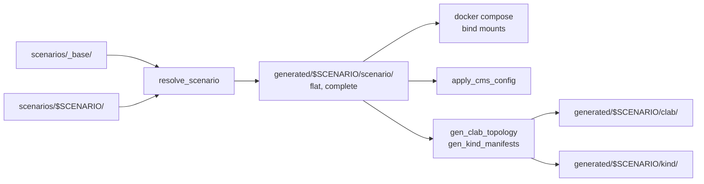

# Lab scenarios: many topologies, one lab

**Date:** 2026-09-08
**Status:** implemented 2026-09-08. Kept as the record of why; the live
documentation is `docs/30-scenarios/index.md`, and a couple of target and path
names below were renamed during implementation.
**Branch:** `feature/next-2026-09`

## Problem

`neops-lab` can express exactly one network. `topology.json`, `workflows/`,
`scope/Global/`, `cms/oidc-config.json`, `function_blocks/` and the FRR seed
config all sit at the repo root, and every consumer hardwires their path:

| Asset | Consumer |
| --- | --- |
| `topology.json` | `gen_device_configs:18` |
| `workflow-execution-parameters/*.json` | `Makefile:228`, `tests/test_gen_clab_topology.py:96` |
| `workflows/*.yaml` | `docker-compose.worker.yml:45` |
| `scope/Global/*.json` | `apply_cms_config:63` |
| `function_blocks/` | `docker-compose.worker.yml:22` |
| `cms/oidc-config.json` | `docker-compose.yml:50` |
| `devices/frr/frr.conf`, `devices/frr/daemons` | `devices/frr/Dockerfile:18` (baked into the image) |
| `devices/frr/set-aliases.sh` | `gen_clab_topology:148`, `gen_kind_manifests:26` |

Showing a second network — a BGP fabric, a single-vendor lab, a deliberately
broken one — means editing those files in place and losing the first. The lab
exists to demonstrate and exercise NeOps; it should be able to demonstrate more
than one thing.

## Goals

- Group the scenario-varying assets into one directory per scenario.
- Select a scenario with a single variable, at the point of running a make target.
- Keep the byte-for-byte generator guard, extended to every scenario.
- Keep one FRR image, one containerlab lab name, one compose project.

## Non-goals

- Running two scenarios at once. They share `lab-net`, `172.30.0.0/24` and the
  compose project; one at a time is a constraint of the design, not an oversight.
- Per-scenario image pins or compose overlays.
- Per-scenario outcome assertions (`make scenario-verify`). Deferred.
- Deletion markers in the overlay (a scenario removing a `_base` file). Deferred
  until a scenario needs one.

## Decisions

| Decision | Choice | Why |
| --- | --- | --- |
| Selection | `SCENARIO` environment variable | Fits the Makefile's existing `?=` convention; no state on disk; one variable understood by make, Python, bash and compose interpolation alike. |
| Inheritance | Overlay on `scenarios/_base/` | A scenario carries only its delta. Six `scope/Global/*.json` files copied per scenario would rot independently. |
| Overlay granularity | Per file | A scenario adding `workflows/bgp-audit.workflow.yaml` still gets `_base`'s discovery workflow; overriding one scope column file keeps the other five. |
| Resolution | Materialised into `generated/$SCENARIO/scenario/` | `docker compose` cannot express fallback in a bind mount. Resolving once into a flat tree keeps every consumer's "one directory" assumption intact and puts the overlay rule in exactly one testable place. |
| `topology.json` | Required per scenario, never inherited | A scenario *is* its topology; there is no meaningful base to fall back to, and inheritance would make the write-back target for the generated discovery params ambiguous. |
| Manifest format | JSON | Host scripts are stdlib-only (AGENTS.md); a YAML manifest could not be read by `make scenarios`. |
| Default scenario name | `wan-and-fabric` | Describes what it is: a 10-node FRR WAN/core/edge/PE network plus a 5-node SR Linux leaf-spine fabric. The Makefile supplies the fallback, so the directory name is free to carry meaning. |

## Layout

```
scenarios/
  _base/                                  every file a scenario MAY override
    workflows/simple-lab-discovery.workflow.yaml
    scope/Global/clientcolumns.json
    scope/Global/dashboard_configuration.json
    scope/Global/devicecolumns.json
    scope/Global/groupcolumns.json
    scope/Global/interfacecolumns.json
    scope/Global/location_drill_down_attribute_schema.json
    devices/frr/frr.conf
    devices/frr/daemons
    devices/frr/set-aliases.sh
    function_blocks/__init__.py
    cms/oidc-config.json
  wan-and-fabric/                         the scenario that exists today
    scenario.json
    README.md
    topology.json                         REQUIRED, never inherited
    workflow-execution-parameters/discover-params.json
    workflow-execution-parameters/discover-params-autodetect.json
    workflow-execution-parameters/discover-params-subnet.json
    workflow-execution-parameters/discover-params-mixed.json
  bgp-fabric/                             illustrative second scenario
    scenario.json
    README.md
    topology.json
    workflow-execution-parameters/*.json
    devices/frr/daemons                   only the delta: turn bgpd on
    workflows/bgp-audit.workflow.yaml     added alongside _base's discovery wf
```

The repo root keeps everything that is not scenario data: `Makefile`, the compose
files, `containerlab`, `apply_cms_config`, the generators, `bootstrap/`,
`clab/probe.clab.yml`, and `devices/frr/Dockerfile` + `devices/frr/entrypoint.sh`.

`cms/jwt/` stays at the root: it is a generated, git-ignored keypair minted by
`make lab-jwt`, not scenario data.

## Mechanism



### `resolve_scenario`

A new host script at the repo root. Extension-less, stdlib-only, Python-3.9-safe,
starting with `from __future__ import annotations`, and added to **both**
`pyproject.toml:45` (ruff `extend-include`) and `pyproject.toml:132` (pyrefly
`project-includes`) — the AGENTS.md invariant that an extension-less script not
in those lists is silently never checked.

Behaviour:

1. Resolve the scenario name from `--scenario NAME`, else `$SCENARIO`. Hard error
   if neither is set.
2. Validate `scenarios/<name>/scenario.json` and `scenarios/<name>/topology.json`
   exist and the manifest carries its required keys.
3. Copy every file under `scenarios/_base/` into `generated/<name>/scenario/`.
4. Copy every file under `scenarios/<name>/` over it. The scenario wins per file.
5. Prune destination files this run did not write, so a deleted override cannot
   linger in a stale `generated/` tree.
6. Print the file-to-source resolution table, so which file came from where is
   auditable without reading the script.

The copy is unconditional and has no exceptions: `README.md`,
`workflow-execution-parameters/` and `scenario.json` land in the resolved tree
alongside the mounted assets. A union with no carve-outs is a rule that fits in
one sentence and needs no lookup table to predict.

Copies, not symlinks: a symlink pointing out of a read-only bind mount does not
resolve inside the container.

### `SCENARIO` plumbing

The Makefile declares the **only** default and exports it:

```make
SCENARIO ?= wan-and-fabric
export SCENARIO
SCENARIO_SRC  := scenarios/$(SCENARIO)
SCENARIO_DIR  := generated/$(SCENARIO)/scenario
GEN_DIR       := generated/$(SCENARIO)
```

Every other consumer reads `SCENARIO` and **fails loudly when it is unset**
rather than carrying its own fallback. A second default is how a scenario gets
half-applied — some assets from the new scenario, some from the old — which is
the worst failure mode this design has to prevent, and it is invisible until
discovery produces a confusing result.

| Consumer | Change |
| --- | --- |
| `docker-compose.yml:50` | `./generated/${SCENARIO}/scenario/cms/oidc-config.json:/etc/neops/oidc-config.json:ro` |
| `docker-compose.worker.yml:45` | `./generated/${SCENARIO}/scenario/workflows:/workflows:ro` |
| `docker-compose.worker.yml:22` | `DIR_FUNCTION_BLOCKS: lab/generated/${SCENARIO}/scenario/function_blocks,neops/fb` |
| `apply_cms_config:63` | `: "${SCENARIO:?SCENARIO must be set}"`, then `SCOPE_DIR="generated/${SCENARIO}/scenario/scope/${SCOPE_NAME}"` |
| `gen_device_configs`, `gen_clab_topology`, `gen_kind_manifests`, `gen_kind_discover_params` | `--scenario NAME`, else `$SCENARIO`, else `SystemExit` |

Bare compose interpolation (`${SCENARIO}`, no `:-` fallback) means a hand-typed
`docker compose ps` needs `SCENARIO=…` in front of it. `.env.example` documents
this, and `docker compose` reads `.env`, so a developer who sets it there once is
covered; the Makefile's exported value wins over `.env` when a target runs.

`./gen_clab_topology` stops being a documented direct invocation; `make generate`
replaces it and supplies `SCENARIO`.

### Generated tree

```
generated/<scenario>/
  scenario/                    resolved overlay; what containers mount
    workflows/ scope/ devices/frr/ function_blocks/ cms/ topology.json scenario.json
  clab/
    neops-lab.clab.json
    frr/<host>.iface
    srl/<host>.cli
    clab-neops-lab/            containerlab runtime dir (TLS keys)
  kind/
    lab.yaml
    discover-params.json
```

`gen_clab_topology:148` currently emits `"../devices/frr/set-aliases.sh:…"`,
relative to `generated/`, where the topology file lives. AGENTS.md warns against
"fixing" that path. With the topology at `generated/<scenario>/clab/`, the
correct relative path becomes `../scenario/devices/frr/set-aliases.sh`, which
also gives each scenario its own copy of the script. The `frr/<host>.iface`
binds are unaffected. **The AGENTS.md invariant must be rewritten, not deleted** —
the point it makes (the path is relative to the topology file's directory, not to
the repo root) still holds.

The containerlab lab **name** stays `neops-lab` for every scenario. A
scenario-suffixed name would let `deploy --reconfigure` leave the previous
scenario's nodes running and fighting over `172.30.0.0/24`; a constant name makes
`--reconfigure` replace one scenario with the next, which is the wanted
behaviour.

## FRR image: stop baking config

`devices/frr/Dockerfile:18` copies `frr.conf` and `daemons` into the image. Left
alone, per-scenario FRR config would force per-scenario image tags — and
`neops-lab-frr:latest` is pinned in the clab topology, the kind manifests and
`docker-compose.worker.yml`.

Instead both files move to the runtime, mounted the way `set-aliases.sh` already
is, and `devices/frr/entrypoint.sh` installs them before `docker-start`. It
already does `chown frr:frr /etc/frr/frr.conf`, so this is a small change:

```sh
for f in frr.conf daemons; do
    [ -f "/lab/$f" ] || { echo "missing /lab/$f (scenario not mounted)" >&2; exit 1; }
    cp "/lab/$f" "/etc/frr/$f"
done
chmod 640 /etc/frr/frr.conf /etc/frr/daemons
chown frr:frr /etc/frr/frr.conf /etc/frr/daemons
```

The `COPY frr.conf` / `COPY daemons` lines and their `chmod`/`chown` leave the
Dockerfile. Nothing is baked, so the config lives in exactly one place —
`scenarios/_base/devices/frr/` — and a scenario that needs `bgpd` ships a
three-line `daemons` delta. Failing hard on a missing mount is deliberate: a
silently wrong FRR config is far more expensive to debug than a container that
refuses to start.

Both flavours converge on one contract: **`/lab/` holds `frr.conf`, `daemons` and
`set-aliases.sh`.** The kind ConfigMap already carries `set-aliases.sh` and
mounts at `/lab` (`gen_kind_manifests:36`); it gains the two new files. The clab
topology binds all three into `/lab/` and execs `sh /lab/set-aliases.sh`. This
also removes an existing divergence — clab uses `/etc/frr/set-aliases.sh` today
while kind uses `/lab/set-aliases.sh` — which is cleanup, listed separately from
the feature.

`set-aliases.sh` keeps reading `/etc/frr/lab-interfaces/$(hostname).iface`; only
the script's own location changes.

## Manifest

`scenarios/<name>/scenario.json`:

```json
{
  "name": "wan-and-fabric",
  "title": "WAN and DC fabric",
  "summary": "10 FRR routers in a WAN/core/edge/PE layout plus a 5-node Nokia SR Linux leaf-spine fabric.",
  "flavours": ["clab", "kind"],
  "demonstrates": [
    "mixed-vendor discovery over SSH",
    "LLDP neighbour discovery on the SR Linux fabric"
  ]
}
```

`flavours` records which of the two deployment paths a scenario supports:
`gen_kind_manifests` renders FRR devices only, so an SR Linux-only scenario is
`["clab"]` and `make kind-lab-up` must refuse it with a clear message rather than
rendering an empty manifest. Long-form prose lives in the scenario's `README.md`.

## Make targets

| Target | Does |
| --- | --- |
| `make scenarios` | List every `scenarios/*/scenario.json`: name, title, summary, flavours, device count. |
| `make scenario-resolve` | Materialise `generated/$(SCENARIO)/scenario/`. |
| `make generate` | `scenario-resolve`, then `gen_clab_topology`; rewrites the committed `workflow-execution-parameters/*.json`. |

`scenario-resolve` is a prerequisite of `local-env-init`, `local-lab-up`,
`local-lab-discover`, `local-cms-config`, `kind-lab-up` and `kind-lab-cms-config`.
Resolution is a handful of file copies, so running it at the top of every
scenario-consuming target is cheaper than reasoning about a stale overlay.

The race ordering inside `local-lab-up` is untouched — `scenario-resolve` is
added before the existing sequence begins, not interleaved into it.

## Testing

- **`tests/test_resolve_scenario.py`** (new): base-only file resolves from base;
  a scenario file of the same name wins; a scenario-only file appears; a file
  removed from a scenario is pruned from a previously-resolved tree; a missing
  `topology.json` or `scenario.json` is an error; an unset `SCENARIO` is an error.
- **`tests/test_gen_clab_topology.py`, `tests/test_gen_kind_manifests.py`,
  `tests/test_gen_kind_discover_params.py`, `tests/test_gen_device_configs.py`**:
  parametrised over `scenarios/*`. The repo's real guard — regenerating from
  `topology.json` reproduces the committed params byte-for-byte — then extends to
  every scenario automatically as scenarios are added. This is the single most
  valuable consequence of the change.
- **`tests/test_host_invariants.py`**: the compose files interpolate `${SCENARIO}`
  into the three scenario mounts; no consumer other than the Makefile carries a
  `SCENARIO` default; `LAB_SUBNET` cross-checks still pass.
- **Manifest shape** test: every `scenarios/*/scenario.json` parses and carries
  the required keys, `name` matches its directory, `flavours` is a subset of
  `{clab, kind}`.

`discover-params-mixed.json` is hand-written, not emitted by `gen_clab_topology`.
It moves with the other three but stays outside the regeneration assertion.

## Docs

`make doc-fix-symlinks` creates a `docs/<dir>` symlink for each root source
directory, and `mkdocs_custom.yml` lists those as `plugins.exclude.glob` entries
so they are include targets rather than pages. `scenarios/*` must be added to
that list, or every scenario `README.md` renders as a stray page.

A new `docs/30-scenarios/index.md` explains the mechanism and `--8<--` includes
each scenario's `README.md` and `scenario.json` through the symlink. Nav goes in
`mkdocs_custom.yml`; `mkdocs.yml` is autogenerated and must never be edited.

`docs/superpowers/*` is excluded from the site by the same mechanism — these
specs are process scaffolding, not operator documentation.

`README.md` (the operator contract) and `AGENTS.md` (the invariants) both need
updating: the `SCENARIO` variable, the new targets, the moved paths, the rewritten
clab-bind invariant, and the FRR image's new runtime-config contract.

## Migration

| From | To |
| --- | --- |
| `topology.json` | `scenarios/wan-and-fabric/topology.json` |
| `workflow-execution-parameters/*.json` | `scenarios/wan-and-fabric/workflow-execution-parameters/` |
| `workflows/simple-lab-discovery.workflow.yaml` | `scenarios/_base/workflows/` |
| `scope/Global/*.json` | `scenarios/_base/scope/Global/` |
| `cms/oidc-config.json` | `scenarios/_base/cms/oidc-config.json` |
| `function_blocks/__init__.py` | `scenarios/_base/function_blocks/` |
| `devices/frr/frr.conf` | `scenarios/_base/devices/frr/frr.conf` |
| `devices/frr/daemons` | `scenarios/_base/devices/frr/daemons` |
| `devices/frr/set-aliases.sh` | `scenarios/_base/devices/frr/set-aliases.sh` |

`devices/frr/Dockerfile` and `devices/frr/entrypoint.sh` stay. All moves are
`git mv`; no file content changes as part of the move itself.

## Risks

1. **The FRR image change is the riskiest part.** It touches both deployment
   flavours and turns a baked-in default into a required mount. A missed mount
   surfaces as a device that will not start — loud, but only at `local-lab-up`
   time, which is the expensive target to run.
2. **Compose interpolation without a fallback** breaks any hand-typed
   `docker compose` command that does not set `SCENARIO`. This is deliberate, and
   the cost is muscle memory.
3. **The clab relative bind path** is called out in AGENTS.md as something not to
   change. It genuinely changes here; the invariant text must be rewritten to
   explain the new resolution, or the next reader will "fix" it back.
4. **Breadth.** Four generators, two compose files, one bash script, the
   Dockerfile, the entrypoint, five test modules, the Makefile, `pyproject.toml`,
   `.env.example`, `README.md`, `AGENTS.md` and the docs all move together. There
   is no useful half-way commit: until every consumer reads `SCENARIO`, the lab
   is half-migrated.

## Cleanup carried along

Separate from the feature, and listed so it can be read apart from it:

- `set-aliases.sh` is invoked from `/etc/frr/` under containerlab and `/lab/`
  under Kubernetes. Both converge on `/lab/`.
- `devices/frr/frr.conf` and `devices/frr/daemons` stop being duplicated between
  an image layer and a scenario override by never being baked at all.
